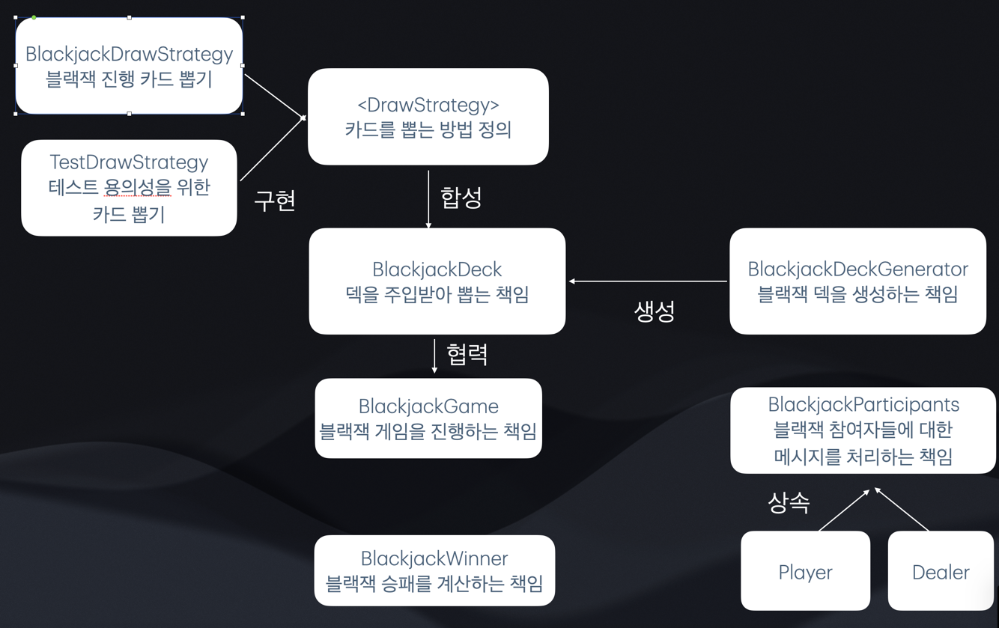

<!-- 

## 코드 리뷰 팁

- 코드와 관련된 질문이 있다면, PR 본문에 적기 보다는 해당 코드를 선택하고 코멘트를 남겨주세요.
  - [참고: Adding comments to a pull request](https://docs.github.com/en/pull-requests/collaborating-with-pull-requests/reviewing-changes-in-pull-requests/commenting-on-a-pull-request#adding-comments-to-a-pull-request)

-->

## 체크 리스트

- [x] 미션의 필수 요구사항을 모두 구현했나요?
- [x] Gradle `test`를 실행했을 때, 모든 테스트가 정상적으로 통과했나요?
- [x] 애플리케이션이 정상적으로 실행되나요?
- [x] [프롤로그](https://prolog.techcourse.co.kr)에 셀프 체크를 작성했나요?   
  https://prolog.techcourse.co.kr/studylogs/4005

## 객체지향 생활체조 요구사항을 얼마나 잘 충족했다고 생각하시나요?

### 1~5점 중에서 선택해주세요.

- [ ] 1 (전혀 충족하지 못함)
- [ ] 2
- [ ] 3 (보통)
- [x] 4
- [ ] 5 (완벽하게 충족)

### 선택한 점수의 이유를 적어주세요.

각 객체의 책임을 설정해서 각자의 책임안에서 메시지를 전달하여 캡슐화를 엄밀하게 지켰다고 생각해서 4점을 주었습니다   
코드의 복잡도는 객체지향과는 상관없다고 생각했습니다

<!-- 이유 작성 -->

## 어떤 부분에 집중하여 리뷰해야 할까요?

<!-- 리뷰어가 효과적으로 피드백할 수 있도록 중점적으로 피드백받고 싶은 내용을 공유해주세요.  
예를 들어, 가장 고민했던 점이나 여전히 어려운 부분, 그리고 이에 대한 생각을 적을 수 있습니다. -->

# 목표

- 플레이어, 딜러의 중복 코드 제거
- 책임 잘 분배하기(기능을 해치지 않는 선에서 책임과 해야하는 일이 명확한 코드)
- TDD - 요구사항 분석을 잘해서 도메인에 대한 이해는 다 하고 시작.
  (설계를 하는 시간은 최소화)
  최소 단위로 테스트를 작성하면서 더 작은 단위가 나오면 그 테스트를 구현하고, 그러면서도 자연스럽게 설계가 좋게 나오게
  (이번에는 TDD 사이클단위로 커밋을 남기지는 않으려 합니다)
- 시간내에 제출

# 협력 관계



# 질문

## 캡슐화 vs 중복 코드 제거

이번 미션의 목표로는

- 딜러와 플레이어에서 발생하는 중복 코드를 제거해야 한다. 가 있었습니다.   
  이를 해결하기 위해서 추상클래스로 상속(isA라서 도입해도 된다고 판단)하였고, 일부분 해소되었습니다.
- 그런데 딜러와 플레이어에게 카드를 주는 행위는, 현재 만들어진 책임을 깨지 않는 선에서는잘 해결이 되지 않았습니다.

``` 기존 코드
            blackjackParticipants.addDealerCard(deck.drawCard());
            public void drawCard(String name) {
              blackjackParticipants.addCard(name, deck.drawCard());
            }
```

기존 코드에는 비슷한 객체(플레이어는 이름을 가지고 딜러는 이름을 가지지 않기 때문에)   
임에도 불구하고 추가하는 메서드를 2가지 가지고 있습니다. 위 코드가 중복 코드라고 보고 개선을 해보려고 하였습니다.

```코드 2
public void drawCard(BlackjackPlayer blackjackPlayer) {
  blackjackPlayer.addCard(deck.drawCard());
}
```

위 코드를 생각해보았는데, 위 코드의 경우 외부에서 BlackjackPlayer를 가지고 있게 되어서 blackjackPlayer에 대한 관리까지 이제 외부에서 해야합니다.   
캡슐화가 깨졌다고 생각합니다.

```방법 3```

- DEALER에게 "딜러"라는 식별 이름 부여하여 players 컬렉션에 포함시키기
- 위 방법은 players에 왜 딜러가 있어야하지?라는 의문과 함께,외부에서 "딜러"라는 이름을 통해 내부에서 처리한다는 것을 이해해야하는 단점이 있었습니다.

### 결론

- 위 3가지 방법중 저는 캡슐화가 가장 잘 되어있는 기존 코드를 유지하기로 결정하였습니다.      
  캡슐화라는 가치는 객체지향에서 꽤 높은 우선순위라고 생각하는 편입니다.(책임이 잘 분배되었는지도 판단할 수 있다고 생각합니다)   
  위 부분은 뭔가 구현을 잘해서 해결할 수 있는 방법은 아닌것 같아 리뷰어분에게 꼭 물어봐야겠다고 생각하였습니다!

## 추상 클래스 도입

- 추상 클래스는 단순 중복 코드 제거를 위해서 도입했을때 결합도가 높아지는 단점이 있는 것으로 알고 있는데,
  이번 추상 클래스를 도입하게 된 상황은 완전히 딜러와 플레이어가 블랙잭플레이어라는 그룹안에서 완전히 isA라고 생각하여서 도입하였는데
  이 경우에는 추상 클래스 도입시에 결합도 단점은 없어보이는데 어떻게 생각하시나요?
- 추상 클래스나 상속같은 관계에서 테스트가 중복이 될 것 같은데 이번에는 테스트가 설계서라는 측면에서 둘다 동일한 동작을 보증하기 위해 테스트를 중복되게 작성을 했는데,
  이러면 테스트에서는 중복코드가 생기는 것이 마음에 걸렸는데, 이 부분 어떻게 테스트 진행해야 효율적일지 궁금해요

## 방어적 api 설계

- 일반적인 흐름상에서는 문제가없지만 방어적으로 api를 설계하려고 했습니다 (drawStrategy가 실제 게임상에서는 deck이 빌 일이 없지만 그에 대한 예외처리를 구현함)
  일반적인 흐름상에서만 로직을 생각하는것과 방어적으로 설계할때 무조건 방어적 설계 하는게 좋을까요?   
  ex)

```
public TrumpCard dealerCardFirst() {
        return dealerCards().get(0);
    }
```

위 코드의 경우 생성자를 거치는 순간부터 항상 카드가 비어있는 순간이 없습니다.
그런데 의도를 좀 더 확실히하기위해 예외 처리를 추가하는것이 좋을까요?

# step1 후기

## 페어

- 블랙잭을 페어로 구현하며 리팩토링을 좀 더 게으르게 해야겠다는 생각을 했습니다
  관련 기능이 모두 구현되고나면 리팩토링을하고 그전까지는 구현을 빠르게 하는것만 집중하는게 페어하는 방식에 좀 더 적합할것같아요

## 캡슐화

- 이번에는 캡슐화에 중점적으로 구현을 해보았습니다.
  그러다보니 중간에 불필요한 객체(Manager 역할)이 생기는 등 컨트롤러에서 메시지를 하나하나 요청하는 코드에서 여러가지 복잡도가 증가했습니다.
  기존에는 캡슐화가 무조건 지켜야하고 1순위인줄 알았는데, 복잡도는 그냥 개발자의 실력아닌가? 하는 생각을 가지고 있었습니다.
  하지만 결국 우리는 프로덕트를 만드는데 시간이라는 가치가 동반되는 경우가 많기 때문에 아무리 완벽한 설계고 캡슐화가 잘되어도 시간앞에서는 1순위가 되지 못할수도 있다는 것을 배웠습니다.
  또 그렇다면 어떤 가치들이 있고 고려해야하는지 step1을 진행하면서 중간중간 크루들과 토론하며 캡슐화와 객체 depth, 복잡성에 대한 트레이드오프를 이해하였고

## 복잡도 낮추기

step2에서는 이런 불필요한 객체를 아예 걷어내보고싶습니다.
step2에서는 캡슐화를 줄이고 복잡성을 낮춰보면 어떻게 느껴질지 경험해보고 그 과정에서 제가 생각하는 적절한 캡슐화에 대한 기준을 생각해보고 싶습니다.
