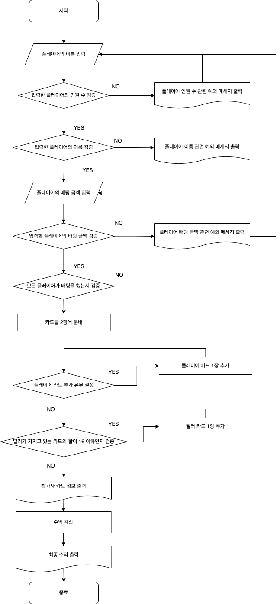

# 🪜 블랙잭 게임 구현 미션

## Pair: 져니 [⛄️](http://github.com/cl8d), 지토 [👽](https://github.com/apptie)

## ✔️ 기능 요구사항

### Participants (참가자들)

- [x] 플레이어의 수는 1명 ~ 7명까지 가능하다.
- [x] 플레이어의 이름은 중복될 수 없다.

### Participant (참가자)

- 플레이어와 딜러를 포괄하는 추상 클래스.
    - [x] 카드를 한 장 받는다.
    - [x] 카드에 적힌 숫자의 합을 계산한다.
    - [x] 가진 모든 카드를 조회한다.
    - [x] 버스트인지 확인한다.
    - [x] 블랙잭인지 확인한다.
    - [x] 참가자의 이름을 조회한다.
    - [x] 분배된 카드를 조회한다.
    - [x] 참가자가 몇 명인지 확인한다.
    - [x] 카드를 더 받을 수 있는지 여부를 반환한다.
    - [x] 플레이어의 승/패/무를 계산한다.
    - [x] 플레이어의 순이익을 계산한다.
    - **ParticipantName (참가자 이름)**
        - [x] 플레이어의 이름의 앞뒤를 공백을 제거한다.
        - [x] 플레이어의 이름은 공백이 들어갈 수 없다.
        - [x] 플레이어의 이름은 1자 ~ 20자까지 가능하다.
    - **ParticipantCard (참가자가 가진 카드)**
        - [x] 모든 카드를 조회한다.
        - [x] 가장 첫 번째 카드를 조회한다.
        - [x] 카드에 적힌 숫자의 합을 계산한다.
        - [x] 버스트 (카드의 합이 21 초과)인지 확인한다.
        - [x] 블랙잭 (카드가 2장이면서, 합이 21)인지 확인한다.
        - [x] 카드를 추가한다.
    - **ParticipantOffset**
        - [x] 플레이어, 딜러의 순서를 인덱스로 변환한다.

### Player (플레이어)

- [x] 플레이어는 '딜러'라는 이름을 가질 수 없다.
- [x] 플레이어는 가지고 있는 카드의 합이 21을 초과하지 않는 경우 카드를 추가로 뽑을 수 있다.
- [x] 플레이어는 게임의 결과를 계산할 수 없다.
- [x] 플레이어는 자신의 순수익을 계산한다.
- **PlayerBet (플레이어 배팅 금액)**
    - [x] 배팅 금액은 1000원 이하일 수 없다.
    - [x] 배팅 금액은 1000원 단위어야만 한다.
    - [x] 배팅 금액과 게임 결과를 통해 수익률을 계산한다.

### Dealer (딜러)

- [x] 첫 번째 카드를 조회한다.
- [x] 딜러는 가지고 있는 카드의 합이 17 이상이 될 때 까지 카드를 추가로 뽑는다.
- [x] 딜러는 순수익을 계산할 수 없다.
- [x] 딜러는 플레이어의 게임 결과를 승/패/무로 계산한다.
    - [x] 딜러가 버스트라면, 모든 플레이어가 승리한다.
    - [x] 플레이어가 버스트라면, 딜러가 승리한다.
    - [x] 일반 참가자와 딜러 모두 버스트라면, 딜러가 승리한다.
    - [x] 딜러가 블랙잭이라면, 딜러가 승리한다.
    - [x] 플레이어가 블랙잭이라면, 플레이어가 승리한다.
    - [x] 딜러와 플레이어 중에 21에 가장 가까운 참가자가 승리한다.
    - [x] 위의 모든 경우가 아니면서 딜러와 플레이어가 동일한 카드의 합을 가지고 있다면, 무승부로 간주한다.
    - [x] 플레이어 이름별 게임 결과를 조회한다.

### Deck (카드들)

- [x] 52장의 카드 뭉치를 생성한다.
- [x] 카드 한 장을 뽑는다.
- **Card (카드)**
    - [x] 카드 패턴과 카드 번호를 조합하여, 카드를 생성한다.
    - [x] 카드가 Ace인지 확인한다.
    - **CardPattern (카드 패턴)**
        - [x] '하트', '스페이드', '다이아', '클로버'를 반환한다.
    - **Denomination (카드 값)**
        - [x] 2~10, Ace, King, Queen, Jack을 반환한다.
        - [x] 카드가 Ace인지 확인한다.
        - [x] 카드의 번호를 조회한다.

### CardSelector (카드 선택기)

- **RandomUniqueCardSelector (랜덤 카드 선택기)**
    - [x] 입력받은 범위 내의 카드 순서를 랜덤하게 반환한다
  
### GameResult (블랙잭의 게임 결과)

- [x] 딜러가 버스트라면, 모든 플레이어가 승리한다.
- [x] 플레이어가 버스트라면, 딜러가 승리한다.
- [x] 일반 참가자와 딜러 모두 버스트라면, 딜러가 승리한다.
- [x] 딜러가 블랙잭이라면, 딜러가 승리한다.
- [x] 플레이어가 블랙잭이라면, 플레이어가 승리한다.
- [x] 딜러와 플레이어 중에 21에 가장 가까운 참가자가 승리한다.
- [x] 위의 모든 경우가 아니면서 딜러와 플레이어가 동일한 카드의 합을 가지고 있다면, 무승부로 간주한다.
- [x] 플레이어 이름별 게임 결과를 조회한다.

### GameManager (게임 관리자)

- [x] 플레이어의 배팅 금액을 초기화한다.
- [x] 모든 참가자에게 게임 시작 시 필요한 카드를 건네준다.
- [x] 딜러가 카드를 뽑을 수 있도록 지시한다.
- [x] 플레이어가 카드를 뽑을 수 있는지 여부를 반환한다.
- [x] 딜러가 카드를 뽑을 수 있는지 여부를 반환한다.
- [x] 플레이어의 순서를 통해 플레이어의 이름을 조회한다.
- [x] 딜러의 이름을 조회한다.
- [x] 게임의 결과를 계산한다.

### GameResult (게임 결과 상수)

- [x] 게임 결과에 따라 배당 비율을 반환한다.

### InputView

- [x] 플레이어의 이름을 쉼표로 구분하여 입력받는다.
- [x] 일반 참가자가 카드를 한 장 더 받을지에 대한 유무를 입력받는다.

### OutputView

- [x] 게임 시작 시, 플레이어의 카드 정보를 출력한다.
- [x] 카드를 받을지에 대한 여부를 입력하면, 현재 가지고 있는 카드를 출력한다.
- [x] 딜러가 카드를 더 받을지에 대한 여부를 출력한다.
- [x] 게임이 완료되면, 플레이어의 카드 종류와 카드의 합을 출력한다.
- [x] 게임이 완료되면, 각 플레이어의 카드 합을 판단하여 최종 승패를 출력한다.

### GameController

- [x] 게임을 실행한다.
- **DrawCardCommand (사용자 입력 명령어)**
    - [x] 사용자가 어떤 명령어를 입력했는지 판단한다.

---

## ✔ 기능 다이어그램

---

## ✔️ 프로그래밍 요구사항

- indent(인덴트, 들여쓰기) depth를 2를 넘지 않도록 구현한다. 1까지만 허용한다.
- 3항 연산자를 쓰지 않는다.
- else 예약어를 쓰지 않는다. (switch/case 포함)
- 모든 기능을 TDD로 구현해 단위 테스트가 존재해야 한다. 단, UI(System.out, System.in) 로직은 제외
- 핵심 로직을 구현하는 코드와 UI를 담당하는 로직을 구분한다.
- 함수(또는 메서드)의 길이가 10라인을 넘어가지 않도록 구현한다.
- 함수(또는 메소드)가 한 가지 일만 하도록 최대한 작게 만들어라.
- 배열 대신 컬렉션을 사용한다.
- 모든 원시 값과 문자열을 포장한다
- 줄여 쓰지 않는다(축약 금지).
- 일급 컬렉션을 쓴다.
- 모든 엔티티를 작게 유지한다.
- 3개 이상의 인스턴스 변수를 가진 클래스를 쓰지 않는다.
- 딜러와 플레이어에서 발생하는 중복 코드를 제거해야 한다.

