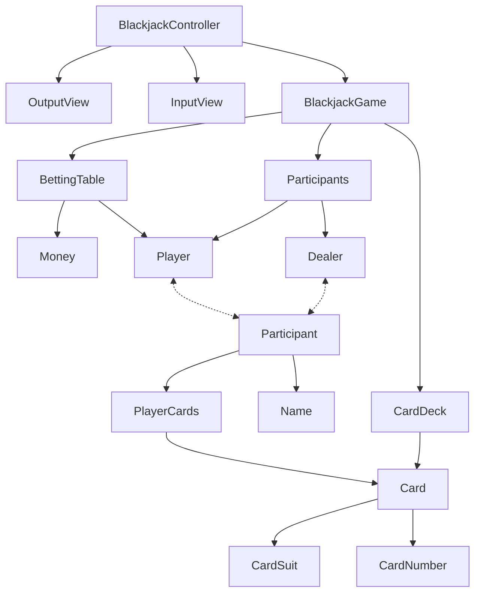

# java-blackjack

블랙잭 미션 저장소

## 우아한테크코스 코드리뷰

- [온라인 코드 리뷰 과정](https://github.com/woowacourse/woowacourse-docs/blob/master/maincourse/README.md)

---

### 기능 목록

## 1단계

- [x] 플레이어 이름을 입력 받는다
    - [x] 이름은 공백 혹은 빈값만 들어올 수 없다
- [x] 중복되지 않는 카드 52개 생성한다
- [x] 딜러와 플레이어에게 카드를 나눠준다
    - [x] 카드 한 장을 나눠준다
    - [x] 처음에 딜러는 카드를 한 장만 공개한다
    - [x] 딜러와 플레이어에게 나눠준 카드를 출력한다
    - [x] 플레이어는 원한다면 카드를 계속 받을 수 있음
    - [x] 딜러는 조건에 따라 카드를 받을 수 있음
- [x] 카드의 합을 통한 승패 판단
    - [x] 카드의 합을 계산한다
        - [x] 카드의 합이 21이하 중 가장 큰 값이 승리
        - [x] 딜러는 16 이하라면 무조건 받음
        - [x] 각 플레이어와 딜러의 카드 결과 출력
        - [x] 각 플레이어와 딜러의 승패 결과 출력

## 2단계

- [ ] 베팅 금액을 입력 받는 기능
    - [ ] 베팅 금액은 1000원 단위로 가능하다
    - [ ] 베팅 금액은 최대 10,000,000원까지 가능하다
- [ ] 수익률을 계산하는 기능
    - 플레이어가 블랙잭으로 이기면 1.5배를 받는다
        - 블랙잭은 카드가 2장일 때 점수가 21이다
    - 플레이어가 이기면 1배를 받는다
    - 플레이어가 지면 -1배를 받는다
- [ ] 수익률을 출력하는 기능
