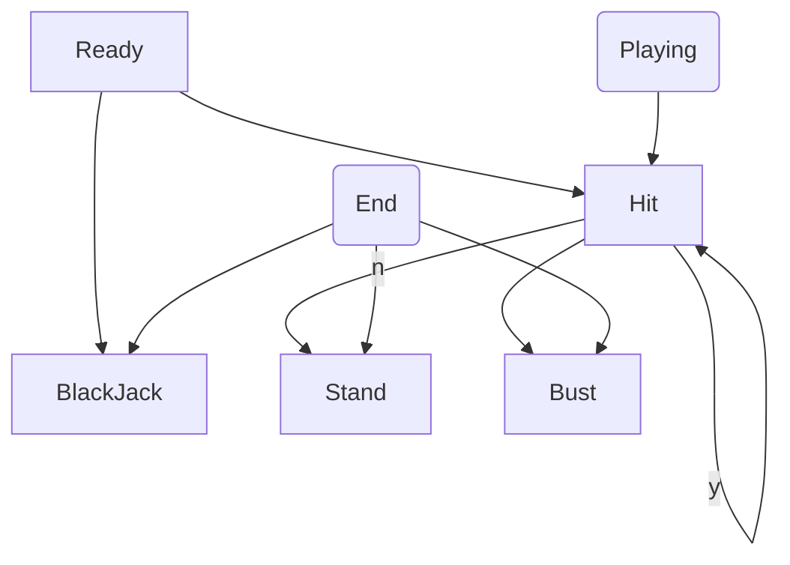

# java-blackjack

블랙잭 미션 저장소

## 우아한테크코스 코드리뷰

- [온라인 코드 리뷰 과정](https://github.com/woowacourse/woowacourse-docs/blob/master/maincourse/README.md)

### 기능 목록

#### 이름 입력

- [x] 10글자 이상의 이름이 들어오면 예외 처리
- [x] 숫자, 특수문자가 들어오면 예외 처리
- [x] 게임 참여자 수는 딜러를 포함해 2명 이상 8명 이하이다.

#### 베팅 금액 입력

- [x] 각 `Player`에 대해 베팅 금액 입력
    - [x] 베팅 금액이 0원 이하이면 예외 처리

#### 카드 생성

- [x] 값: A, 2, 3, 4, 5, 6, 7, 8, 9, 10, J, Q, K
- [x] 모양: 스페이드, 클로버, 다이아몬드, 하트
- [x] 값과 모양을 가지는 `Card` 객체를 생성한다.
- [x] 위에 없는 값과 모양의 객체는 예외 처리한다.
- [x] `CardDeck` 객체는 랜덤으로 카드를 반환한다.

#### 카드 받기

- [x] 모두 2장의 카드를 받는다.
- [x] 플레이어는 2장의 카드를 모두 공개한다.
- [x] **딜러**는 합계가 16점 이하면 반드시 1장의 카드를 추가로 받아야 한다.
- [x] **딜러**는 합계가 17점 이상이면 카드를 추가로 받을 수 없다.
- [x] 플레이어에게 카드를 더 받을 지 물어본다.
    - [x] 플레이어가 `y`를 입력하면, 카드를 하나 더 반환한다.
    - [x] 플레이어가 `n`을 입력하면, 넘어간다.
    - [x] `y, n`이 아닌 다른 문자가 들어오면 예외 처리한다.

#### 점수 집계

- [x] 모든 플레이어는 카드를 받을 때마다 점수를 추가해서 저장한다.
- [x] J, Q, K는 10으로 계산한다.
- [x] Ace는 11로 계산하되, 합계가 21이 넘는 경우 1로 계산한다.
- [x] 모든 딜러와 플레이어는 점수가 21을 초과하면 `Bust` 된다.

#### `Status` 관리하기

- 게임 중 상태: `Hit`
    - 새로운 카드를 받거나, 그만 받기(`Stand`)를 선택할 수 있음
- 게임 종료 상태: `BlackJack`, `Stand`, `Bust`
    - profit rate 반환

#### 결과 출력

- [x] 딜러가 `Bust`되지 않은 경우
    - [x] 딜러보다 낮은 점수를 가진 플레이어는 `패`이다.
    - [x] `Bust`한 플레이어는 `패`이다.
    - [x] 딜러보다 높은 점수를 가진 플레이어는 `승`이다.
    - [x] 딜러와 같은 점수를 가진 플레이어는 `무`이다.
- [x] 딜러가 `Bust`된 경우
    - [x] 모든 플레이어는 '승'이다.
- [x] 딜러가 `BlackJack`인 경우
    - [x] 플레이어가 `BlackJack`이면 `무`이다.
    - [x] 플레이어가 `BlackJack`이 아니면 `패`이다.

### 1단계 궁금증

0. 기능 목록을 어떻게 잘 작성할까?
    - 어떤 경우에는 실제 코드의 구현 목록에 비해 작성해 놓은 기능 목록이 너무 추상적이어서, 아무리 코드를 작성해도 체크할 것이 없다고 느낄 때가 있다.
    - 반대로, 지나치게 구체적인 기능 목록을 작성하여, 이 코드를 처음 보는 개발자에게 무슨 뜻인지 알기 어렵다고 느낄 때도 있다.
    - 이번에는 기능 목록을 코드의 작성에 따라 굉장히 구체적으로 작성하는 페어를 만나 페어의 방식대로 따라해 보았는데, 절충점을 찾을 필요가 있다고 느꼈다.

1. 상속 클래스를 사용했을 때의 장점은 무엇일까?
    - `Participant`를 상속받아 `Player`와 `Dealer`를 만들었다.
    - 처음에는 `Participants`에서 `Player`와 `Dealer`를 모아 놓은 `List<Participant> participants`로 관리했다.
        - 다형성을 이용했다는 생각에 굉장히 만족스러웠는데, 하위 클래스인 `Player`와 `Dealer`를 같은 리스트에 관리하니, 문제점이 많이 생겼다.
            - 외부에서 `participants`의 형 변환이 어려웠다.
            - 나와 페어의 임의대로 0번째 index를 `Dealer`, 그 이후를 `Player`들로 채워 놓았는데, 우리의 임의대로 나누다 보니, 코드를 보는 다른 개발자가 이해하기 어려울 것이라는
              생각이 들었다. (내부 로직의 불확실성)
            - 따라서 이 방식을 폐기하고 `Participants`에서 필드로, `List<Player> players`과 `Dealer`를 별도로 관리하는 현재의 코드 방식을 선택했다.

    - 형 변환에 대한 부담감, 내부 로직의 불확실성 때문에 선택한 방법 또한 의문이 많이 들었다. (2번 궁금증)
        - 장점: 현재 코드는 `Participant` 객체에서 `Player`와 `Dealer`의 공통적인 부분(점수 계산, 카드 추가로 받기, Bust인지 반환)을 다루고 있어 코드의 중복 제거라는 목적을
          달성했다.

2. `Participants` 내에 `List<Player> players`와 `Dealer`를 필드로 관리 VS `Participants` 클래스 없이 `Dealer`와 `Players`(일급컬렉션) 클래스로
   분리해 관리 중 어떤 방법이 더 좋을까?
    - 현재 `Participants` 클래스의 주요한 역할은 생성자에 있다. 생성 시에 모든 참가자에게 `card`를 두 장씩 나누어주는 역할을 한다. 따라서 현재의 방식으로는 후자를 택할 수 없다.
    - 단점: `getPlayerNames()`같은 메서드는 `Players` 클래스로 나누었다면 `getNames()`로 더 자연스럽게 사용할 수 있을 것 같다.

3. 부수효과 제거에 관하여...
    - 페어는 처음에 `Player` 클래스에서 `List<Card>` 외에도 `Score`를 필드로 관리하자고 제안했다.
    - 장점: `Player` 객체의 입장에서 생각했을 때, 완전한 정보를 갖게 된다.
    - 단점: 카드를 받은 상황이 변화할 때마다 `Score`를 업데이트 해야 한다.
        - 별도의 메서드를 두어 외부에서 업데이트를 호출하도록 하는 경우, 호출하지 않는 경우 상태가 업데이트되지 않아 불안정하다.
        - 별도의 메서드를 두지 않고, 카드를 받는 곳에서 업데이트하는 경우, 카드를 받는 함수를 호출하는 사람이 인지할 수 없는 부수 효과이다.
            - 현재로는 점수를 업데이트하는 정도의 부수 효과이지만, DB에 저장한다던가 다른 내용의 코드일 경우에 더 더 위험해질 수 있다고 생각한다.
        - 카드를 받으면서 메서드 이름을 변경하여 점수 또한 업데이트하는 것으로 알려줄 경우, 부수효과로 인한 위험은 줄어들지만 하나의 메서드는 하나의 일만 해야 한다는 원칙에 위배되고, 따라서 그에 대한
          패널티로 메서드의 재활용성과 테스트 용이성이 떨어질 수 있다.
    - 결과적으로 제출한 코드에서는 `Score`는 필드에서 제거했고, 플레이어의 상태로 보유한 카드만을 관리하며 점수가 필요한 경우, 그때그때 계산해서 반환한다.
    - 현재까지 나의 생각
        - 보유한 카드에 대한 정보와 점수는 겹치는 정보이다. 엄밀히 말하면 카드에 대한 정보를 알면 점수 계산은 따라오지만, 점수를 안다고 해서 어떤 카드를 가졌는지는 알 수 없으므로 카드가 더 큰 정보라고
          생각한다. 겹치는 정보를 필드로 관리해서 좋았던 기억이 없다. 두 가지 필드를 동시에 같은 상태로 맞추는 것이 생각보다 까다로웠기 때문이다.
        - 따라서 현재까지 나의 생각은 따라서 더 큰 정보(카드)를 필드로 관리하고, 필요한 경우 계산해서 반환하면 된다는 것이다.

    - 상상의 나래...
        - 그런데, 매번 계산해서 반환하는 것이 굉장히 부담스러워질 만큼 프로그램이 커진다면, 어떻게 해야하지?
        - 현재 미션에서는 전체 카드를 보고 Ace인 경우 다르게 처리해야 하므로, 최종적으로 선택한 방식이 특별히 불리하다고 생각하지는 않지만, 만약에 아주아주 큰 연산 위에 딱 하나의 계산을 추가하면 되는
          상황이라면? 매번 모든 계산을 처음부터 호출하는 것이 똑똑한 방식일까?

4. 예외에 대하여
    - 우리가 현재 사용하는 예외가 진짜 예외 상황일까?
        - 예외를 던지지 않고 마음에 드는 입력값이 올 때까지 반복문을 돌리는 방식은 어떤 장단점이 있을까?
    - 예외 대신 `Optional`을 반환한다면 어떤 장점이 있을까?
    - `Cards` 클래스에서 준비한 52장의 카드가 모두 사라져 `EmptyStackException`이 발생하는 경우, 별도의 처리를 하지 않았다. 이에 대비해 인원 제한을 미리 해 두긴 했지만, 만약에
      발생할 경우 어떤 방식으로 처리해야 할까?

### 1단계 추가 리팩터링 목록

- [x] 모든 클래스는 `final` 또는 `abstract`이다.
- [x] `view`와 `domain`을 최대한 끊어놓도록 노력하자.
- [x] `Score`을 계산하는 논리가 복잡해지니, 값 객체로 분리한다.
- [ ] ~~카드를 받을 수 있는지 여부도 공통이니, 추상 메서드로 분리한다.~~
- [ ] 불변객체를 만들고, 반환하도록 노력하자.
- [ ] 카드 52개를 매번 생성해야 할까? 캐싱 해보자.
- [ ] `MethodSource`를 이용한 `ParameterizedTest`로 테스트 코드를 개선해 보자.
- [ ] `Participant`가 가진 `List<Card> cards`를 일급컬렉션으로 만들어 관리해보자.

### 1단계 리팩터링 궁금증

1. `getter`를 통해 받은 `Dealer`와 `Player` 객체는 방어적 복사를 하더라도, `receiveCard()`를 외부에서 실행할 수 있어 위험합니다. 어떻게 해결할 수 있을까요?
    - `Participants`의 `getDealer()` 메서드에서 `return new Dealer()`를 반환해서, 참조하는 주소를 다르게 보내는 것이 좋은 방법일까요?
2. 피드백 강의를 듣고, `Score`를 값 객체로 빼냈는데, 이미 21곳에서 `calculateScore`를 사용하고 있어서, 리턴 타입을 `Score`로 바꾸기가 힘들 때는 보통 어떻게 하시나요? 그냥
   아쉽더라도 `int`로 두는 것이 더 좋은 선택일까요?
3. `BlackJackGame`이 현재 하는 일이 거의 없는 클래스입니다. `Controller`에서 필드를 두지 않기 위해서 필요하지 않은데 억지로 만든 클래스라는 느낌이 강해요. 이 객체를 없애면서
   어떻게 `MainController`의 메서드를 깔끔하게 분리할 수 있을까요?
4. `Controller`가 상태를 가지면 안 된다(필드에 변수가 있으면 안 좋다)는 의견이 크루들 사이에 많은데, 도메인에 대해 컨트롤러가 의존성을 가지는 것이 뭐가 문제가 되는지 잘 모르겠습니다. 카일 의견도
   궁금해요!

### 2단계 리팩터링 목록

- [ ] 테스트 코드의 관리
    - [x] 같은 `Card`는 `Fixtures` 클래스에서 관리해서 중복을 최대한 없앤다.
- [ ] 접근 제어자를 통해서 `Status`의 자유로운 호출을 관리한다.
- [x] `Money` 초기 입력 값에 대한 검증
- [x] `Cards`에서 다른 `Cards`와 비교를 통해 승/무/패를 관리 - 카일

- [x] 플레이어가 버스트 되면 딜러가 무조건 이긴다는 규칙이 반영되지 않은 것 같아요.

- [ ] 2단계에 짠 테스트 코드들 `DisplayName` 넣어주기
