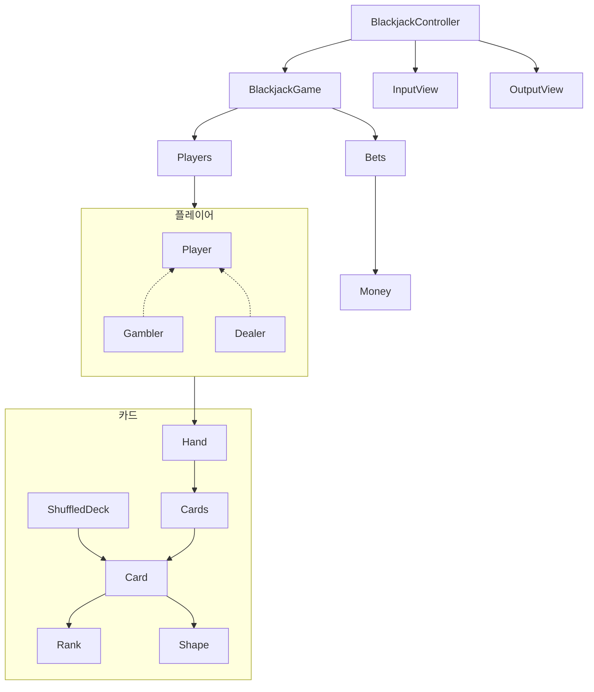
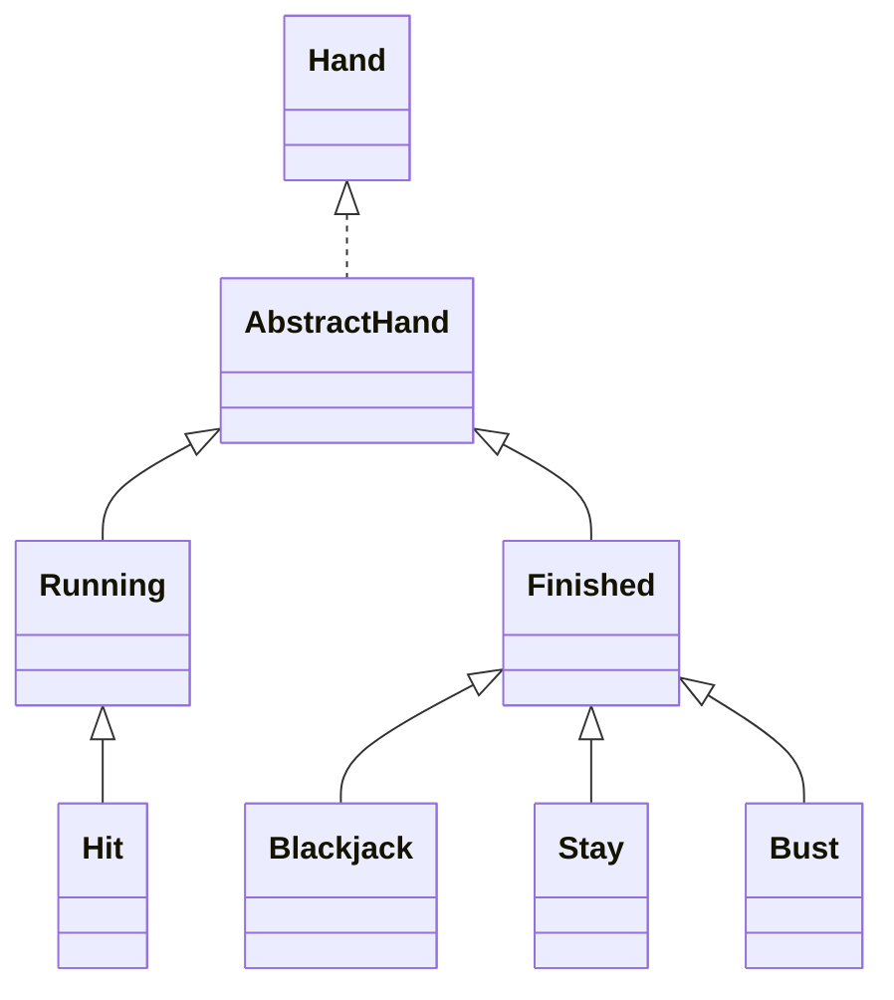

# java-blackjack

블랙잭 미션 저장소

## 우아한테크코스 코드리뷰

- [온라인 코드 리뷰 과정](https://github.com/woowacourse/woowacourse-docs/blob/master/maincourse/README.md)

### 의존성 다이어그램





### 블랙잭 게임 개요

블랙잭 게임을 변형한 프로그램을 구현한다.   
블랙잭 게임은 딜러와 플레이어 중 카드의 합이 21 또는 21에 가장 가까운 숫자를 가지는 쪽이 이기는 게임이다.

카드의 숫자 계산은 카드 숫자를 기본으로 하며, 예외로 Ace는 1 또는 11로 계산할 수 있으며, King, Queen, Jack은 각각 10으로 계산한다.  
게임을 시작하면 플레이어는 두 장의 카드를 지급 받으며, 두 장의 카드 숫자를 합쳐 21을 초과하지 않으면서 21에 가깝게 만들면 이긴다.   
21을 넘지 않을 경우 원한다면 얼마든지 카드를 계속 뽑을 수 있다.  
딜러는 처음에 받은 2장의 합계가 16이하이면 반드시 1장의 카드를 추가로 받아야 하고, 17점 이상이면 추가로 받을 수 없다.  
게임을 완료한 후 각 플레이어별로 승패를 출력한다.

### 요구사항

**블랙잭 게임**

- [x] 블랙잭 게임을 진행한다.
    - [x] 블랙잭 게임 시작 시 각 플레이어에게 카드를 두 장씩 배분한다.
    - [x] 일정한 규칙에 의해 플레이어는 카드를 더 받을 수 있다.
    - [x] 블랙잭 게임은 딜러와 갬블러의 카드 숫자의 합으로 승패가 결정된다.
        - [x] 각 카드의 점수 합이 21을 초과하지 않으면서, 21에 가장 가까운 플레이어가 승리한다.
            - [x] 딜러가 추가로 카드 뽑기 전 겜블러의 카드 점수의 합이 21을 초과하면 게임에서 패배한다.
            - [x] 딜러와 갬블러가 둘 다 버스트가 아닌 경우 점수가 같으면 무승부가 된다.
            - [x] 블랙잭인 경우 승리한다. 단, 딜러와 갬블러 둘 다 블랙잭인 경우 무승부가 된다.

          | Gambler\Dealer | BLACKJACK | STOP | BUST |
          |----------------|-----------|-------|-------|
          | BLACKJACK | 무승부 | 겜블러 승 | 겜블러 승 |
          | STOP | 딜러 승 | 값 비교 | 겜블러 승 |
          | BUST | 딜러 승 | 딜러 승 | 겜블러 패 |
    - [x] 베팅 결과에 따라 수익이 결정된다.
      - [x] 블랙잭으로 승리한 경우 베팅 금액의 1.5배를 추가로 받는다.
      - [x] 승리한 경우 베팅 금액만큼 추가로 받는다.
      - [x] 무승부인 경우 베팅 금액을 그대로 돌려 받는다.
      - [x] 패배인 경우 베팅 금액을 모두 잃는다.

**카드**

- [x] 카드는 총 52장이 존재한다.
    - [x] 각 카드는 중복이 없고, 모양과 랭크의 고유한 조합으로 구성된다.
    - [x] 모양은 하트, 다이아몬드, 스페이드, 클로버로 구성된다.
    - [x] 랭크는 Ace, 숫자 2부터 10, Jack, Queen, King 으로 구성된다.
    - [x] 각 카드는 점수를 가진다.
        - [x] 카드의 점수는 카드 랭크와 같다.
        - [x] Ace는 1 또는 11로 계산한다.
            - [x] Ace는 플레이어에게 유리하게 계산한다. 카드 점수의 합이 21을 초과하지 않으면서, 21에 가까운 값이 되도록 계산한다.
        - [x] Jack, Queen, King은 각각 10으로 계산한다.

**딜러**

- [x] 블랙잭 게임의 딜러는 1명 존재한다.
    - [x] 딜러는 `딜러` 라는 이름을 가진다.
    - [x] 딜러는 게임 시작 시 카드 1장을 받는다. (추후에 한 장을 더 받는다.)
    - [x] 딜러의 카드 점수의 합이 16이하이면 16을 초과할 때까지 카드를 더 받는다.

**겜블러**

- [x] 겜블러는 최소 1명, 최대 6명까지 게임에 참가할 수 있다.
    - [x] 겜블러는 이름을 가진다.
        - [x] 겜블러의 이름은 중복될 수 없다.
        - [x] 딜러 이름은 사용할 수 없다.
        - [x] 갬블러의 이름은 최소 1자, 최대 5자로 구성된다.
        - [x] 갬블러의 이름이 null, 빈값, 5자를 초과하는 경우 예외를 던진다.
    - [x] 갬블러는 게임 시작 시 카드 2장을 받는다.
    - [x] 카드 점수의 합이 21을 넘지 않으면 다음과 같은 행동 중 하나를 선택할 수 있다.
        - [x] HIT: 카드를 한 장 더 받는다.
        - [x] STAY: 멈춘다.

### 입력

- [x] 블랙잭 게임에 참가할 사람들의 이름을 입력받는다.
    - [x] 쉼표`,` 기준으로 분리하여 입력받는다.
- [x] 플레이어의 베팅 금액을 입력받는다.
    - [x] 숫자가 아닌 값을 입력하면 예외를 던진다. 
- [x] 카드를 더 받을지 입력받는다.
    - [x] 카드를 더 받는 경우 y를 입력받는다.
    - [x] 카드를 더 받지 않는 경우 n을 입력받는다.
    - [x] y/n이 아닌 다른 값을 입력받는 경우 예외를 던진다.
- [x] 올바르지 않은 값을 입력할 시 재입력 시도는 5회로 제한한다.

### 출력

- [x] 딜러와 갬블러가 카드를 나눠 가진 후, 각자의 카드를 공개한다. (딜러는 1장만 공개한다.)
  ```
  딜러, pobi, jason에게 2장을 나누었습니다.
  딜러: 3다이아몬드
  pobi카드: 2하트, 8스페이드
  jason카드: 7클로버, K스페이드
  ```

- [x] 게임을 진행 후 블랙잭 진행 내용과 점수를 출력한다.
  ```
  딜러는 16이하라 한장의 카드를 더 받았습니다.
  딜러카드: 3다이아몬드, 9클로버, 8다이아몬드 - 결과: 20
  pobi카드: 2하트, 8스페이드, A클로버 - 결과: 21
  jason카드: 7클로버, K스페이드 - 결과: 17
  ```

- [x] 최종 수익을 출력한다.
  ```
  ## 최종 수익
  딜러: 10000
  pobi: 10000
  jason: -20000
  ```
