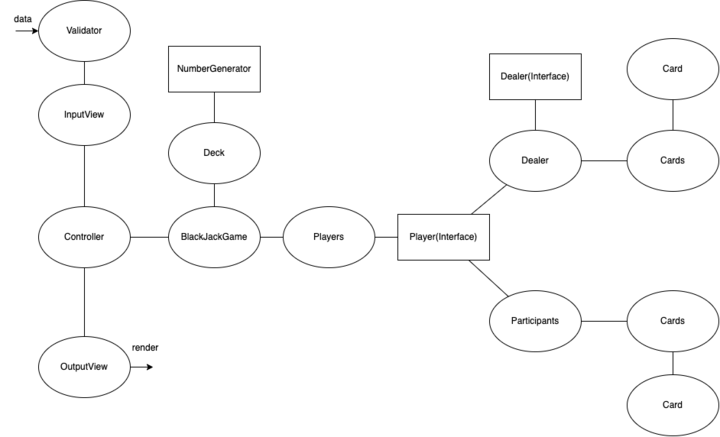

# java-blackjack

블랙잭 미션 저장소

## 우아한테크코스 코드리뷰

- [온라인 코드 리뷰 과정](https://github.com/woowacourse/woowacourse-docs/blob/master/maincourse/README.md)

## 기능 목록

### 입력

- [x] 참여할 사람의 이름 입력
  - [x] 이름은 쉼표로 구분된다
  - [x] 공백은 허용하지 않는다
- [x] 각 참여자가 카드를 한장 더 받을지 입력
  - [x] 공백은 허용하지 않는다

### 출력

- [x] 카드 나눔 메시지 출력
- [x] 모든 플레이어가 가지고 있는 카드를 출력한다
- [x] 카드를 받거나 받지 않으면 가지고 있는 카드를 출력한다
- [x] 딜러가 카드를 더 받으면 받았다는 메시지를 출력한다
- [x] 딜러와 모든 참여자의 카드와 결과를 출력한다
- [x] 최종 승패를 출력한다

### 도메인

- [x] 플레이어
  - [x] 이름을 가진다
  - [x] 카드들을 가진다
  - [x] 배팅 금액을 가질 수 있다
  - [x] 가지고 있는 카드의 숫자를 계산할 수 있다
  - [x] 카드를 한장 받는다

- [x] 딜러
  - [x] 딜러는 플레이어이다 
  - [x] 카드의 합이 임계값보다 작거나 같으면 히트이다
  - [x] 딜러는 카드를 1장 덜 보여준다

- [x] 이름
  - [x] 1~5자의 길이만 허용된다

- [x] 카드
  - [x] 타입을 가진다
  - [x] 숫자를 가진다

- [x] 덱
  - [x] 모든 카드를 가진다
  - [x] 카드를 섞는다
  - [x] 카드를 한 장 반환한다

- [x] 카드풀
  - [x] 카드를 가질 수 있다
  - [x] 카드 숫자의 합을 계산한다.
    - [x] 에이스는 11일 때 숫자의 합이 21이 넘으면 1로 계산한다
  - [x] 에이스가 있는지 판단할 수 있다.

- [x] 블랙잭 게임
  - [x] 덱을 초기화 한다
  - [x] 모든 딜러와 참여자에게 카드를 뽑는 명령을 내린다
  - [x] 모든 참여자와 딜러의 승패를 알고 있다
  - [x] 하나 이상의 플레이어가 이기면, 딜러는 각각의 플레이어의 총 배팅 금액만큼을 잃는다
    - [ ] 어떤 플레이어의 처음 두 장의 카드가 블랙잭이면, 1.5배를 잃는다
      - [ ] 딜러와 플레이어 모두가 블랙잭이라면 아무도 잃지 않는다
  - [x] 딜러가 이기면, 상대 플레이어는 배팅 금액을 전부 잃는다 

- [x] 카드 섞기 규칙
  - [x] 랜덤으로 섞는다

## 객체 다이어그램

### 고민사항
- DeckMaker 객체를 둘지, Deck 안에서 생성 책임까지 가질지?
- 플레이어들을 getter를 사용해 가져와 반복문을 돌리는 경우가 있는데, Iterator 생성은 어떤가?
  내부 구현은 숨기면서, 내부에 접근할 수 있다는 점에서 좋은 것 같은데, 만들기에는 너무 오버헤드가 큰지 고민임.
- 개발자들을 위해 존재하는 예외 메세지는 개발자만 이해할 수 있도록 정보를 제공해도 될까?

### 2단계 고민사항
- TDD 사이클에서 ParameterizedTest를 사용해도 될까? ParameterizedTest를 사용하면 여러 케이스를 동시에 검증하기에 TDD에 부적절하지는 않을까?
- `딜러는 처음에 한 장의 카드를 숨겨야 한다`는 요구사항을 잊고 있다가 구현하고 보니 getter에서 리스트를 변형하는 등 많은 작업을 하고 있는 것 같다. 괜찮을까?
- 요구사항 중 `인스턴스 변수를 3개 이상 쓰지 않는다`가 있었다. 하지만 플레이어가 배팅 금액을 가지는 과정에서 인스턴스 변수가 3개가 되어버린다.  
  그렇다고 해서 배팅 금액을 Player에서 분리하느냐? 이것은 예측하기 어려운 설계라고 생각한다. 프로그래밍 요구사항을 어기는 것은 금기인가? 좋은 설계가 우선이 아닐까?
- void 타입 메소드를 선호하는데, 괜찮은걸까? 객체지향에서 사실 void 타입은 존재하지 않아도 되는데.
- fixture를 처음 사용함. 다만 fixture 안에 값에 맞는 enum 객체를 찾기 위한 로직이 들어가게 됨. 괜찮을까?
- 
