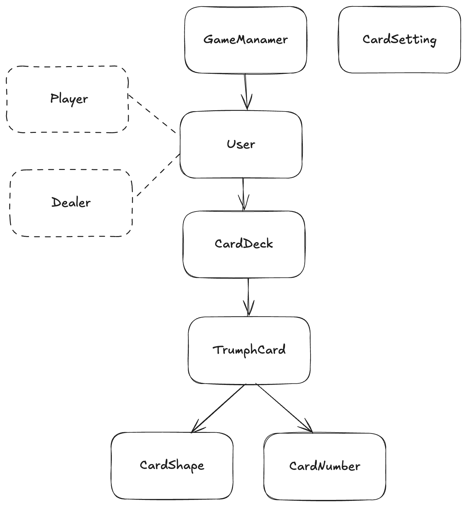
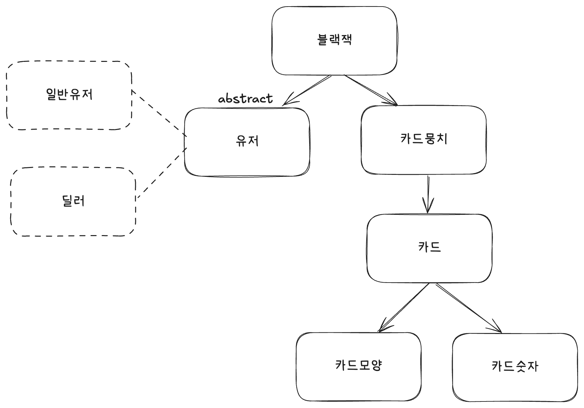

# java-blackjack

# 목표

- 상태 기반 X 메시지 기반 설계 O
- 새 기능이 추가되었을때, 기존 클라이언트, 코드가 덜 수정되도록 구현해보는 경험
- 충분한 테스트 커버리지

# 요구사항

- [X] 딜러는 처음에 받은 2장의 합계가 16이하이면 반드시 1장의 카드를 추가로 받아야 하고, 17점 이상이면 추가로 받을 수 없다.
    - [X] 1장의 카드를 받은 뒤에도 16이하인 경우 16 초과가 될때까지 추가로 받는다
- [x] 게임을 시작하면 플레이어는 두 장의 카드를 지급 받으며, 두 장의 카드 숫자를 합쳐 21을 초과하지 않으면서 21에 가깝게 만들면 이긴다. 21을 넘지 않을 경우 원한다면 얼마든지 카드를 계속 뽑을 수
  있다.
    - [X] 카드의 합이 21인 경우에도 더 받을지 묻는다
- [X] 버스트시에는 다시 묻지 않는다
- [x] 게임을 완료한 후 각 플레이어별로 승패를 출력한다.
    - [x] 승 패는 플레이어 vs 딜러인 상황에서 판정한다
    - [x] 무승부인 경우 승과 패 둘다 아닌것으로 계산한다(플레이어에게는 무승부라고 출력됨)

- [x] 플레이어 수는 2-8명으로 제한한다.(딜러포함)
- [X] 카드가 부족하면 예외가 발생한다

- [x] 플레이어는 카드를 받을 수 있다
    - [x] 플레이어는 카드의 합이 21이하인 경우 카드를 받을 수 있다
    - [x] 카드의 합이 21이 넘은 경우 더 이상 받을 수 없다

- [x] 플레이어는 베팅할 수 있다
    - [x] 21을 초과할 경우 배팅 금액을 모두 잃게 된다
    - [x] 처음 2장이 블랙잭이라면 1.5배를 딜러에게 받는다
    - [x] 딜러와 플레이어 모두 블랙잭인 경우 베팅한 금액을 돌려받는다

# step2

- 딜러와 플레이어가 나뉘기떄문에 BlackjackGame에서도 딜러와 플레이어에게 주는 코드가 2개씩 존재하는데
  이부분 저는 명확하다고 생각이드는데 찰리 생각도 궁금해서 질문하고 싶어졌어요 ㅎㅎ
- 기존의 책임을 가지고 있던 BlackjackWinner를 사용하게 되었습니다. 그런데 해당 객체는 생성자가 파라미터로 받는데,
- BlackjackBet에서는 이런 생성자를 가지고 있지 않다보니 기본 생성자를 만들어서 사용하는방식과 스태틱으로 유틸성으로 만드는 방법이 떠올랐는데,
  기본 생성자 방식의 경우에는 잘못된 사용을 허용하게되다보니 유틸성 메서드를 사용하는게 더 낫다고 생각했어요!
- 이럴때는 (여기저기서 의존되고 유틸성으로 메서드를 제공해야하는 경우에) 유틸성 메서드를 허용해도 된다고 생각하는데 어떻게 생각하세요 찰리?

## 베팅금액 구현

- BlackjackParticipant가 베팅을 가지도록하였습니다
- 그러면서 기존의 Delaer 코드를 유지하기 위해 생성자를 한개 더 만드는 식으로 구현하였습니다

## 신경쓴점

- 기존 코드를 다 갈아엎지않고, 최소한만 변경해보려고 노력하였습니다.
- (Participant의 추상 클래스 사용, 부모 클래스에서 betting이 필요해져서 필드에 추가함 but, dealer등 직접적으로 betting을 수정하지않아도 사용할 수 있게 생성자 추가 등)

## 파라미터 4개를 사용하고 dto를 사용하지 않기

- 도메인이 dto를 알고있어야하는 것은 dto까지 알아야하기때문에 결합도가 높다고 생각했어요. 따라서 파라미터가 4개인채로 유지하는것이 더 낫다고 생각하였습니다.

## BlackjackGame의 생성자를 정적 방식으로 바꾼 이유

- 기존의 테스트에서 전부 생성자 방식을 사용하고 있었고, 베팅 금액이라는 기능이 없는 테스트가 많음
- 베팅 금액을 지원하는 BlackjackGame 생성 -> 파라미터로 구분지어야함 = 정적 팩토리 방식으로 변경하였음
  그렇다면 블랙잭게임은 베팅, 논베팅모드가 가능함
- 따라서 블랙잭 결과를 내는것도 베팅,논베팅모드에 따라 바뀌어야함 따라서 논베팅일때 결과내는 코드를 남겨서 여지를줌

## BlackjackParticipant의 책임은 맞지만, 상태가 외부에서 주어져야할 경우 static사용

--- 위의 파라미터가 4개가되고 생성자를 정적 방식으로 바꾸는 등 모두 데이터를 기반으로 설계해서 나온 문제라고 생각이 되었습니다.
또, 컨트롤러 코드가 많은 이유도 객체가 스스로하기보다는 컨트롤러에서 비즈니스 로직의 개입이 너무 많다고 생각들었습니다.
위 설계가 좀 더 메시지 기반 설계에 가깝다고 생각하는데 찰리의 생각도 궁금해요!!
