# java-blackjack

블랙잭 미션 저장소

## 우아한테크코스 코드리뷰

- [온라인 코드 리뷰 과정](https://github.com/woowacourse/woowacourse-docs/blob/master/maincourse/README.md)

```mermaid
classDiagram
    Participant <|-- Dealer
    Participant <|-- Player
    class Participant {
        #Name name
        #Cards cards
        *isPlayer()
        *isDealer()
        *getStartCards()
        *canDrawCard()
    }
    class Dealer {
        
    }
    class Player {
        -validateBlacklist()
        +matchGame(Dealer dealer)
        +matchGameWithBet(Dealer dealer)
    }
    class Participants {
        -List~Participant~ participant
        -validateDuplicatePlayer(List~Player~ players)
        +getPlayers()
        +getDealer()
        +getPlayers()
    }
    class BlackJackGame {
        -Participants participants
        -Deck deck
        +getPlayerNames()
    }
    class Name {
        -String name
        -validateBlankName(String name)
        -validateNameLength(String name)
    }
    class Cards {
        -List~Card~ cards
        +addCard(Card card)
        +calculateScore()
        +isBlackjack()
    }
    class Card {
        -Suit suit
        -Rank rank
    }
    class Deck {
        -Deque~Card~ deck
        +drawCard()
        +drawCards(int count)
    }
    class Score {
        -int value
        +isWinTo(Score other)
    }
    class Bet {
        -int bet
        +calculateResult(GameResult gameresult)
    }
    class Rank {
        <<enumeration>>
        ACE
        ...
        KING
    }
    class Suit {
        <<enumeration>>
        SPADE
        DIAMOND
        HEAT
        CLOVER
    }
    class GameResult {
        <<enumeration>>
        BLACKJACK
        WIN
        LOSE
        DRAW
    }
```

## 기능 요구 사항

### 게임 진행

- [X] 게임이 시작하면 참여할 사람의 이름을 입력 받는다.
    - [X] 이름은 `,`로 구분한다.
    - [X] 이름이 공백이거나 5자리를 넘으면 `IllegalArugmentException`을 던진다.
    - [X] 중복된 이름이 있으면 `IllegalArugmentException`을 던진다.
    - [X] 이름이 `딜러`이면 `IllegalArugmentException`을 던진다.
- [X] 참여할 사람을 입력받은 후 참여할 사람의 배팅금을 입력 받는다.
    - [X] 배팅금은 0보다 크면 `IllegalArugmentException`을 던진다.
    - [X] 배팅금은 100,000,000보다 작으면 `IllegalArugmentException`을 던진다.
- [X] 참여할 사람을 입력받은 후 딜러와 참여한 사람에게 카드를 2장씩 지급한다.
    - [X] 지급된 카드는 중복이 될 수 없다. (유일해야 한다.)
- [X] 참여한 사람은 두 장의 카드 합이 21을 초과하지 않으면 카드를 계속 뽑을 수 있다.
    - [X] 선택을 할때마다 가지고 있는 카드의 목록을 출력한다.
- [X] 카드를 다 뽑으면 다음 사람이 카드를 뽑는다.
- [X] 모든 사람이 카드를 뽑으면 딜러가 카드를 뽑는다.
    - [X] 딜러가 가진 카드의 합이 16 이하이면 1장을 뽑고, 16을 초과하면 뽑지 않는다.
- [X] 딜러와 참여한 사람의 카드와 결과를 출력한다.
- [X] 최종 수익을 출력하고 종료한다.

### 비즈니스 요구사항

- [X] 카드의 숫자 계산은 카드 숫자를 기본으로 한다.
- [X] `ACE`는 1 또는 11로 계산한다.
- [X] `KING`,`QUEEN`,`JACK`은 각각 10으로 계산한다.
- [X] 사용자의 카드 합이 `21`이 넘으면 사용자는 무조건 패배한다.
- [X] 딜러의 카드 합이 `21`일때 사용자의 카드 합이 `21`이면 무승부이고 아니면 패배한다.
- [X] 딜러의 카드 합이 `21`을 초과할 때 사용자의 카드 합이 `21`을 초과하지 않으면 사용자가 승리한다.
- [X] 딜러의 카드 합이 `21`미만일때 사용자의 카드 합이 딜러보다 작으면 패배하고 같으면 무승부이고 초과하면 승리한다.
- [X] 지급되는 카드는 유일해야 한다.
- [X] 카드를 추가로 뽑을 때 카드의 합이 `21`을 초과하면 더이상 뽑을 수 없다.
- [X] `ACE` 카드가 있을 때는 `1` 또는 `11`로 계산하여 `21`을 넘지 않으면서 21에 가장 가까운 점수를 선택한다.
- [X] 패배하면 배팅금을 모두 잃는다.
- [X] 승리하면 배팅금을 받는다.
- [X] 무승부일 경우 수익이 없다. (돈을 그대로 돌려 받는다.)
- [X] 사용자의 처음 두 장의 카드 합이 `21`이면 배팅금 1.5배를 받는다. 이때 딜러의 카드합이 `21`이면 수익이 없다.

### 입력 요구 사항

- [X] 게임에 참여할 사람은 `,`로 구분하여 입력한다.
- [X] 카드를 추가로 뽑을 때 `y` 또는 `n`을 입력한다.
