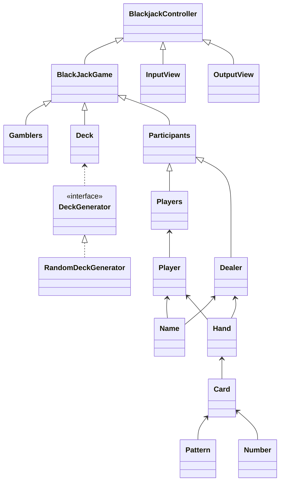

# java-blackjack

블랙잭 미션 저장소

## 우아한테크코스 코드리뷰

- [온라인 코드 리뷰 과정](https://github.com/woowacourse/woowacourse-docs/blob/master/maincourse/README.md)

## Class Diagram

## ✨기능 구현 목록

- [x] 게임 참여자의 이름을 입력 받는다.
    - [x] 이름은 공백제외 1글자 이상 5글자 이하로 한다.
    - [x] 중복된 이름은 사용할 수 없다.
    - [ ] 게임참여자는 최대 6명이다.

- [x] 덱을 만든다.
    - [x] 덱은 패턴과 숫자를 조합해 52장을 만든다.
    - [x] 덱을 랜덤으로 섞는다.

- [x] 카드를 나눠준다.
    - [x] 딜러와 참여자에게 2장씩 나눠준다.

- [x] 나눠준 카드를 이름과 함께 출력한다.
    - [x] 딜러는 1장만 출력한다.

- [x] 플레이어마다 카드를 추가로 받을 지 입력받는다.
    - [x] y 면 카드를 추가로 받고
    - [x] n 이면 카드를 받지 않는다.
    - [x] y또는 n이 아닐경우 예외발생

- [x] 딜러가 카드를 추가로 받을 지 결정한다.
    - [x] 딜러의 카드 합이 16이하면 카드를 추가로 받는다.
    - [x] 딜러의 카드 합이 17 이상이면 카드를 받지 않는다.

- [x] 딜러와 플레이어의 카드를 출력한다.

- [x] 카드의 점수를 계산한다.
    - 에이스가 포함되어있을 때
    - [x] 점수 합계가 11 이하이면 10점을 더한다.
    - [x] 점수 합계가 11 초과이면 유지한다.

- [x] 승패를 계산한다.
    - [x] 딜러의 카드합이 높으면 딜러승
    - [x] 딜러보다 플레이어의 카드합이 높으면 플레이어 승
    - [x] 딜러와 플레이어의 카드합이 같으면 무승부
    - [x] 딜러의 카드합이 모두 21 초과면 플레이어 패

## step2 기능구현 목록

- [x] 플레이어 마다 배팅금액을 입력받는다.
    - [x] 배팅 금액은 숫자만 입력가능하다.
    - [x] 최소 배팅금액은 100원이다
    - [x] 최대 배팅금액은 1000000이다.
    - [x] 배팅은 100원단위로 가능하다

- [x] 플레이어가 블랙잭으로 이긴 경우 배팅 금액의 1.5배를 받는다.

- [x] 승무패에 따른 최종수익을 출력한다.
