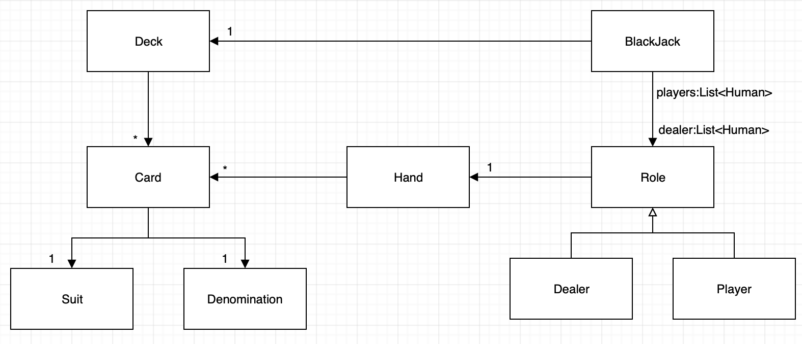

# java-blackjack

블랙잭 미션 저장소

## 우아한테크코스 코드리뷰

- [온라인 코드 리뷰 과정](https://github.com/woowacourse/woowacourse-docs/blob/master/maincourse/README.md)

## 구현 사항

1. 사용자가 블랙잭에 필요한 데이터를 입력한다
    1. 플레이어들의 이름을 입력한다.
        1. 플레이어 이름은 ','로 구분된다.

2. 게임 진행
    1. 플레이어와 딜러는 게임 시작 후 각 두 장의 카드를 나눠 갖는다.
    2. 플레이어 카드의 총 합이 21이 넘지 않으면 사용자로부터 카드 한 장 추가 여부를 입력받는다.
        1. 카드 한 장 추가를 입력받으면 카드를 받는다.
    3. 딜러 카드의 총 합이 16이하면 카드를 받는다.
        1. 딜러가 가지고 있는 초기 카드 두 장 중 ace가 존재하고 ace를 1과 11중 어느 수로 사용하느냐에 따라 카드 한장 추가 여부가 달라진다면 ace를 어느 수로 할 지를 결정하고 구한 총 합에
           따라 게임을 진행한다.
    4. 결과 점수 계산:
        1. 플레이어와 딜러는 항상 최적의 해만을 고려한다고 가정한다.
        2. 따라서 ace를 1로 할지, 11로 할지는 최적의 해(21에 가장 가까운 답) 계산을 통해 산출한다.
        3. 이를 위해 패를 King부터 ace까지 내림차순으로 정렬해 가지고 있는다.
            1. ace가 제일 마지막에 존재해야 ace를 어느 값으로 할지 결정할 수 있기 떄문이다.

3. 게임 결과
    1. 각 플레이어는 딜러와 대결을 하여 승패 여부를 결정하고 결과를 출력한다.
    2. 딜러는 각 플레이어와의 대결 결과를 모두 종합하여 결과를 출력한다.

## 블랙잭 모델 다이어그램

