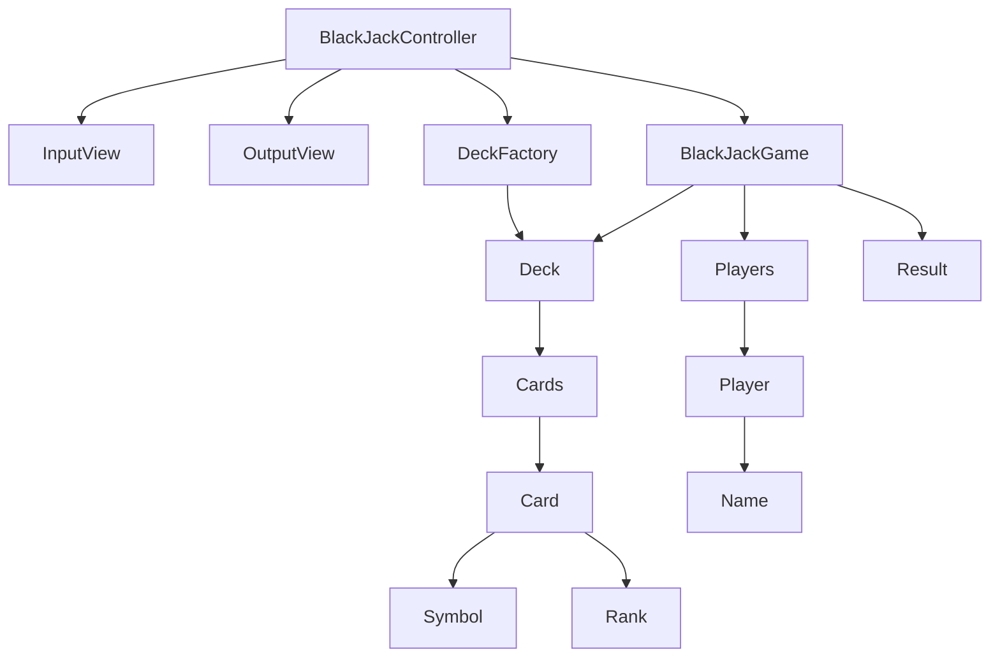

# java-blackjack

블랙잭 미션 저장소

## 우아한테크코스 코드리뷰

- [온라인 코드 리뷰 과정](https://github.com/woowacourse/woowacourse-docs/blob/master/maincourse/README.md)

## 블랙잭 개요

- 블랙잭 게임은 딜러와 플레이어가 진행한다.
- 카드의 합이 21에 가장 가까운 숫자를 가지는 쪽이 이기는 게임이다.
- 숫자 계산은 카드의 숫자를 기본으로 하되,
  - Ace: 1 or 11
  - King, Queen, Jack: 10
- 게임을 시작하면, 딜러와 플레이어는 두 장의 카드를 지급받는다.
- 플레이어는 카드 숫자의 합이 21 미만이라면 카드를 계속 뽑을 수 있다.
- 딜러는 카드 숫자의 합이 16 이하인 경우에만 1장의 카드를 추가로 받아야 한다.
  - 딜러는 최대 3장의 카드만 받을 수 있다.
- 게임이 완료되면, 각 플레이어의 승패를 출력한다.

## 도메인 다이어그램

## 기능 구현 목록

### 플레이어

- [ ] 이름을 가진다.
  - [x] 최소 1자, 최대 10자까지 가능하다.
  - [ ] 앞, 뒤 공백은 제거한다.
  - [ ] 중간 공백은 허용한다.
  - [ ] 중복되는 이름은 가질 수 없다.
  - [x] `딜러`라는 이름은 가질 수 없다.
- [ ] 여러 명일 수 있다.
  - [ ] 최대 5명이다.

### 카드

- [ ] 문양을 가진다.
- [ ] 숫자를 가진다.

### 덱

- [ ] 카드 목록을 가진다.
- [ ] 카드를 섞는다.
- [ ] 카드를 뽑는다.
  - [ ] 카드가 없으면 뽑을 수 없다.

### 블랙잭 게임

- [ ] 플레이어가 카드를 더 뽑을 수 있는지 판단한다.
- [ ] 플레이어의 카드를 추가한다.
- [ ] 점수를 계산한다.

### 결과

- [ ] 딜러와 플레이어의 점수를 확인한다.
- [ ] 딜러가 몇 승 몇 패인지 확인한다.
- [ ] 플레이어의 승패 여부를 확인한다.

### 입력

- [ ] 플레이어의 이름을 입력한다.
- [ ] 카드를 받을 여부를 입력한다.

### 출력

- [ ] 딜러와 플레이어의 카드 현황을 출력한다.
- [ ] 딜러 카드 추가 여부를 출력한다.
- [ ] 최종 결과를 출력한다.
- [ ] 최종 승패를 출력한다.
