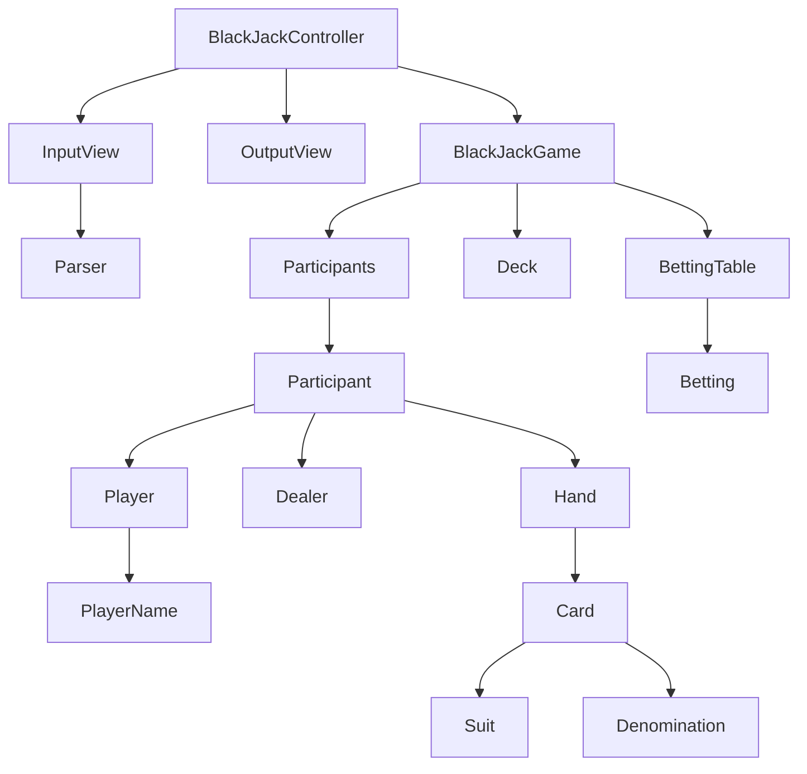

# java-blackjack

블랙잭 미션 저장소

## 우아한테크코스 코드리뷰

- [온라인 코드 리뷰 과정](https://github.com/woowacourse/woowacourse-docs/blob/master/maincourse/README.md)

## 블랙잭 개요

- 블랙잭 게임은 딜러와 플레이어가 진행한다.
- 카드의 합이 21에 가장 가까운 숫자를 가지는 쪽이 이기는 게임이다.
- 숫자 계산은 카드의 숫자를 기본으로 하되,
    - Ace: 1 or 11
    - King, Queen, Jack: 10
- 게임을 시작하면, 플레이어는 베팅 금액을 정한다.
- 딜러와 플레이어는 두 장의 카드를 받는다.
    - 처음 두 장의 카드 합이 21일 경우 블랙잭으로 베팅 금액의 1.5배를 딜러에게 받는다.
    - 동시에 블랙잭이라면 플레이어는 베팅한 금액을 딜러에게 받는다.
- 플레이어는 카드 숫자의 합이 21 미만이라면 카드를 계속 뽑을 수 있다.
    - 카드를 추가로 뽑아 21을 초과하면 베팅 금액을 모두 잃는다.
- 딜러는 카드 숫자의 합이 16 이하인 경우에만 1장의 카드를 추가로 받아야 한다.
    - 딜러는 최대 3장의 카드만 받을 수 있다.
- 게임이 완료되면, 각 플레이어의 승패를 출력한다.

## 블랙잭 규칙

- `승`, `무`, `패`는 플레이어에 결과를 나타낸다.
- 플레이어 점수가 21점 초과일 때
    - 딜러 점수 상관없이 `패`
- 플레이어 점수가 21점 이하일 때
    - 딜러 점수가 21점 초과일 때
        - 플레이어 `승`
    - 딜러 점수가 21점 이하일 때
        - 플레이어 점수가 높으면 `승`
        - 플레이어 점수가 낮으면 `패`
        - 플레어어 점수와 같으면 `무`

- 수익은 아래와 같이 계산된다.
    - 플레이어가 블랙잭일 때
        - 게임에서 승리했다면, 수익은 베팅 금액의 1.5배가 된다.
        - 게임에서 비겼다면, 수익은 없다.
    - 플레이어가 블랙잭이 아닐 때
        - 게임에서 승리했다면, 수익은 베팅 금액의 1배가 된다.
        - 게임에서 비겼다면, 수익은 없다.
        - 게임에서 졌다면, 베팅 금액만큼 지출이 발생한다.

## 도메인 다이어그램

## 기능 구현 목록

### 참가자

- [x] 카드를 받는다.
- [x] 블랙잭 여부를 확인한다.
- [x] 점수를 확인한다.
- [x] 딜러인지를 확인한다.
- [x] 카드 추가 여부를 확인한다.
- [x] 여러 명일 수 있다.
    - [x] 딜러는 포함되어야 한다.
    - [x] 중복되는 이름은 가질 수 없다.
    - [x] 최대 6명이다.

### 딜러

- [x] `딜러`라는 이름을 가진다.
- [x] 블랙잭 게임 결과를 보여준다.
- [x] 카드 패를 숨긴 채로 드러낸다.
- [x] 카드를 뽑을 수 있는 점수를 확인한다.
- [x] 카드를 추가적으로 뽑았는지 확인한다.

### 플레이어

- [x] 이름을 가진다.
    - [x] 최소 1자, 최대 10자까지 가능하다.
    - [x] 중간 공백은 허용한다.
    - [x] `딜러`라는 이름은 가질 수 없다.

### 덱

- [x] 카드 목록을 가진다.
- [x] 트럼프를 이용해 덱을 생성한다.
- [x] 카드를 뽑는다.
    - [x] 카드가 없으면 뽑을 수 없다.

### 카드

- [x] 문양을 가진다.
- [x] 숫자를 가진다.
- [x] 에이스인지 확인한다.

### 핸드

- [x] 카드를 추가한다.
- [x] 점수를 계산한다.
- [x] 카드 개수를 확인한다.

### 베팅 테이블

- [x] 플레이어의 베팅을 확인한다.

### 베팅

- [x] 베팅 금액은 100원 이상, 100만 원 이하까지 가능하다.

### 입력

- [x] 플레이어의 이름을 입력한다.
    - [x] 앞, 뒤 공백은 제거한다.
- [x] 카드를 받을 여부를 입력한다.
- [x] 베팅 금액을 입력한다.

### 출력

- [x] 딜러와 플레이어의 카드 현황을 출력한다.
- [x] 딜러 카드 추가 여부를 출력한다.
- [x] 최종 결과를 출력한다.
- [x] 최종 승패를 출력한다.
