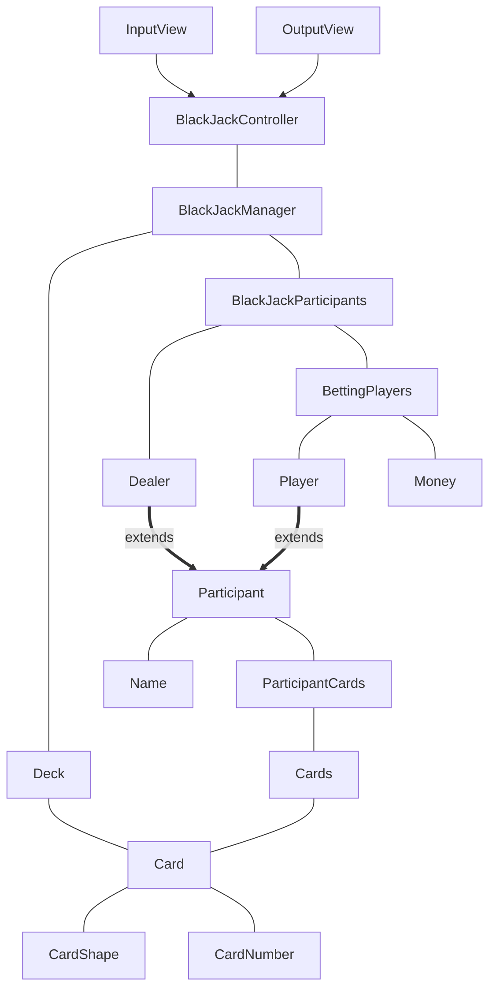
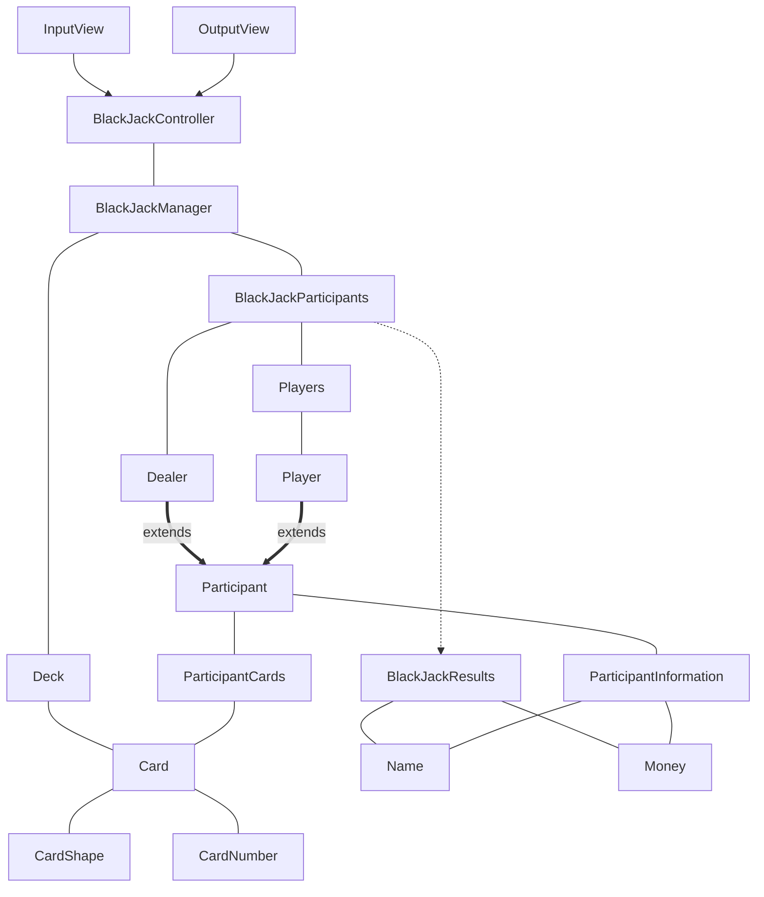

# java-blackjack

블랙잭 미션 저장소

## 우아한테크코스 코드리뷰

- [온라인 코드 리뷰 과정](https://github.com/woowacourse/woowacourse-docs/blob/master/maincourse/README.md)

## 페어

|  |  |
|:---------------------------------------------------------------------------------:|:----------------------------------------------------------------------------------:|
|                          [베로](https://github.com/Cyma-s)                          |                         [헤나](https://github.com/hyena0608)                         | |

## 규칙

- 20분 마다 페어는 번갈아가면서 진행한다.
- 모르는 것을 지나치지 않는다.
- 멍 때리면 괜찮냐고 물어봐주기.
- 혹시 페어가 마음이 상할까 봐 하고 싶은 말을 숨기지 않는다.
- 최대한 6시 이전에 할 일을 끝낸다.

## 입력

- 사람 이름을 입력받는다.
    - 사람 이름은 쉼표로 구분된다.
    - 이름이 공백일 경우 예외가 발생한다.
    - 이름이 중복일 경우 예외가 발생한다.
    - 이름은 영문이어야 한다.
- 히트 여부를 입력받는다.
    - 히트 여부는 (y / n)만 가능하다.
    - 버스트일 경우 히트가 불가능하다.

## 출력

- 게임 시작시, 딜러의 카드 한 장과 플레이어들의 카드를 출력한다.
- 딜러는 각 플레이어에게 히트할 지 물어본다.
    - 플레이어의 카드를 최소 한 번 출력한다.
    - 플레이어가 히트할 시에 카드를 출력한다.
- 딜러의 히트 여부를 출력한다.
- 딜러와 플레이어의 카드와 카드 숫자의 합을 출력한다.
- ~~최종 승패를 출력한다.~~

## 요구사항

- 블랙잭 게임은 딜러와 플레이어 중 카드의 합이 21 또는 21에 가까운 숫자를 가진 사람이 이긴다.
- 에이스는 1, 11로 계산될 수 있다.
- 카드는 카드 숫자가 계산 숫자이다.
- K,Q,J는 10으로 계산한다.
- 딜러와 플레이어는 두 장의 카드를 지급 받는다.
- 플레이어는 21을 넘지 않을 경우 카드를 계속 뽑을 수 있다.
- 플레이어는 카드 숫자 합이 21 이상일 경우 카드를 뽑을 수 없다.
- 딜러는 카드 숫자 합이 16 이하면 반드시 16을 초과할 때까지 카드를 추가로 받는다.
- 딜러는 카드 숫자 합이 17 이상이면 카드를 추가로 받을 수 없다.
- 딜러와 플레이어의 카드 숫자 합이 21을 초과할 경우 버스트한다.
- 플레이어의 카드 숫자 합이 딜러의 카드 숫자 합보다 21에 가까운 경우 플레이어가 승리한다.
- 딜러의 카드 숫자 합이 플레이어의 카드 숫자 합보다 21에 가까운 경우 플레이어가 패배한다.
- 카드는 A, 2~10, K,Q,J가 존재한다. 다이아몬드,스페이드,하트,클로버 모양 당 카드 숫자는 한 장씩 존재핝다.
- 플레이어와 딜러의 카드 숫자 합이 동일하면 무승부(푸쉬)된다.
- 첫 카드 배분 시에 카드 숫자 합이 21을 초과할 경우 카드를 더 받지 못하고 버스트된다.
- 카드 숫자 합을 계산할 때 21에 최대한 가깝게 A 값을 계산한다.
- 플레이어는 카드 숫자 합이 유리한 쪽으로 A 값을 결정한다.
- 딜러 카드는 무작위로 한 장 오픈한다.
- 플레이어가 모두 스테이하고, 딜러의 차례가 끝나면 게임을 종료한다.

## 2차 입력

- 각 플레이어의 배팅 금액을 입력받는다.

## 2차 출력

- 딜러와 플레이어의 최종 수익을 출력한다.

## 2차 요구사항

- 플레이어는 카드를 추가로 뽑아 21을 초과할 경우 
  - 배팅 금액을 모두 잃는다,
- 플레이어의 처음 두 장의 카드 합이 21일 경우
  - 블랙잭이 된다.
  - 배팅 금액의 1.5배를 딜러에게 받는다.
- 딜러와 플레이어 모두 동시에 블랙잭인 경우
  - 플레이어는 배팅한 금액을 돌려받는다.

