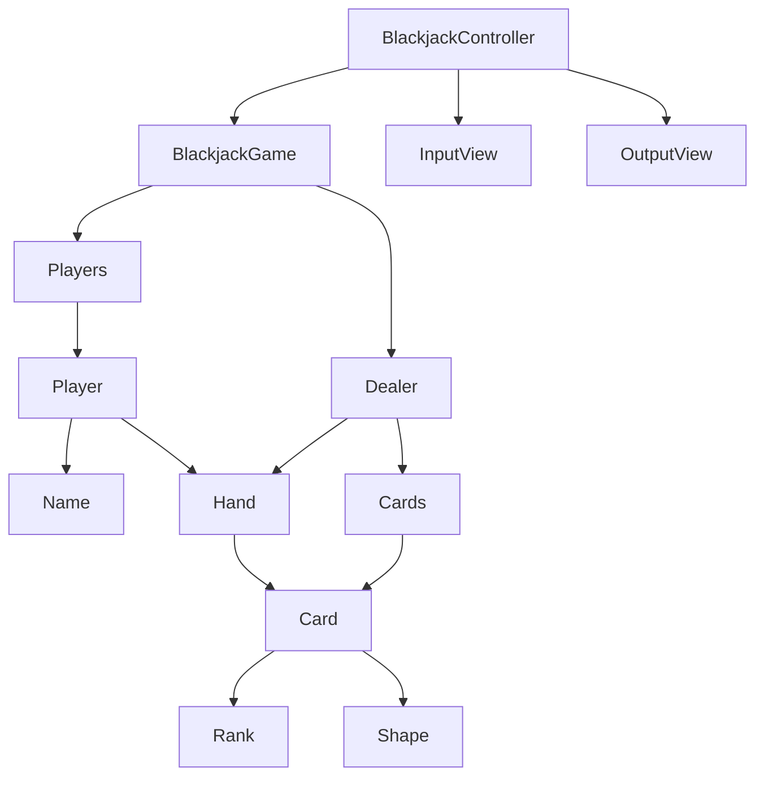

# java-blackjack

블랙잭 미션 저장소

## 우아한테크코스 코드리뷰

- [온라인 코드 리뷰 과정](https://github.com/woowacourse/woowacourse-docs/blob/master/maincourse/README.md)

### 의존성 다이어그램

### 블랙잭 게임 개요

블랙잭 게임을 변형한 프로그램을 구현한다.   
블랙잭 게임은 딜러와 플레이어 중 카드의 합이 21 또는 21에 가장 가까운 숫자를 가지는 쪽이 이기는 게임이다.

카드의 숫자 계산은 카드 숫자를 기본으로 하며, 예외로 Ace는 1 또는 11로 계산할 수 있으며, King, Queen, Jack은 각각 10으로 계산한다.  
게임을 시작하면 플레이어는 두 장의 카드를 지급 받으며, 두 장의 카드 숫자를 합쳐 21을 초과하지 않으면서 21에 가깝게 만들면 이긴다.   
21을 넘지 않을 경우 원한다면 얼마든지 카드를 계속 뽑을 수 있다.  
딜러는 처음에 받은 2장의 합계가 16이하이면 반드시 1장의 카드를 추가로 받아야 하고, 17점 이상이면 추가로 받을 수 없다.  
게임을 완료한 후 각 플레이어별로 승패를 출력한다.

### 요구사항

- [ ] 블랙잭 게임을 진행한다.
    - [ ] 블랙잭 게임은 각 카드의 점수 합이 21을 초과하지 않으면서, 21에 가장 가까운 사람이 승리한다.
    - [ ] 딜러와 플레이어의 카드 숫자의 합으로 승패가 결정된다.
        - [ ] 딜러와 플레이어 점수가 높은 사람이 승리한다.
        - [ ] 딜러와 플레이어의 점수가 같으면 무승부가 된다.
        - [ ] 카드 점수의 합이 21을 넘으면 게임에서 패배한다.

- [ ] 카드는 총 52장이 존재한다.
    - [ ] 각 카드는 모양과 랭크의 조합으로 구성된다.
    - [ ] 모양은 하트, 다이아몬드, 스페이드, 클로버로 구성된다.
    - [ ] 랭크는 Ace, 숫자 2부터 10, Jack, Queen, King 으로 구성된다.
    - [ ] 각 카드는 점수를 가진다.
        - [ ] 카드의 숫자 계산은 카드 숫자를 기본으로 한다.
        - [ ] Ace는 1 또는 11로 계산할 수 있다.
        - [ ] Jack, Queen, King은 각각 10으로 계산한다.

- [ ] 블랙잭 게임의 딜러는 1명 존재한다.
    - [ ] 딜러는 처음에 카드 2장을 받는다.
    - [ ] 두 장 중 한 장은 플레이어에게 공개되지 않는다.
    - [ ] 딜러의 카드 점수의 합이 16이하이면 16이상이 될 때까지 카드를 한 장씩 더 뽑는다.

- [x] 플레이어는 최소 1명, 최대 6명까지 게임에 참가할 수 있다.
    - [x] 플레이어의 이름은 중복될 수 없다.
    - [x] 플레이어의 이름은 최소 1자, 최대 5자로 구성된다.
        - [x] 플레이어 이름이 null, 빈값, 5자를 초과하는 경우 예외를 던진다.
    - [ ] 플레이어는 처음에 카드 2장을 받는다.
    - [ ] 카드 점수의 합이 21을 넘지 않으면 다음과 같은 행동 중 하나를 선택할 수 있다.
        - [ ] 카드를 한 장 더 뽑는다.
        - [ ] 멈춘다.

### 입력

- [ ] 블랙잭 게임에 참가할 사람들의 이름을 입력받는다.

### 출력

- [ ] 블랙잭 게임의 결과를 출력한다.
