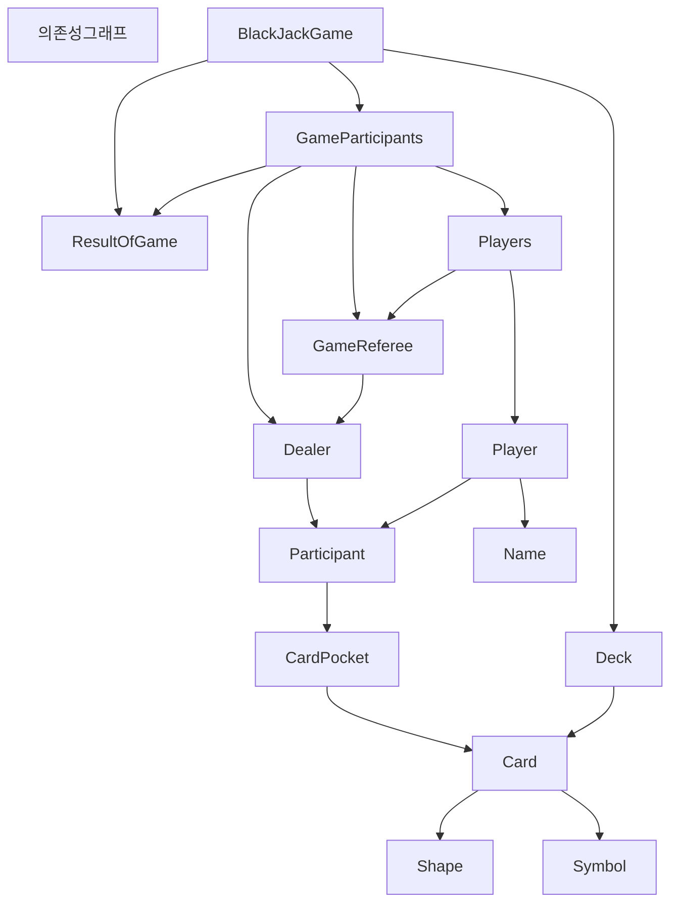

# java-blackjack

블랙잭 미션 저장소

## 우아한테크코스 코드리뷰

# 기능구현 목록

## UI
### 입력
1. 게임에 참여할 사람의 이름 입력받기
    - 쉼표 기준으로 분리한다
    - 분리한 글자들의 공백을 제거한다
    - List<String>으로 타입 변경 후 반환한다
2. 플레이어 마다 베팅금액을 입력받는다
   - 메서드 인자로 플레이어의 이름을 받는다
   - 숫자를 입력받는다
   - 숫자가 아니면 예외를 반환한다
3. 플레이어 마다 카드를 한장 더 받을 것인지 묻는다
   - 메서드 인자로 플레이어의 이름을 받는다
   - 입력 받은 글자가 명령 enum에 없는 경우 예외를 발생시킨다
   - 명령 enum클래스로 타입 변경 후 반환한다

### 명령 enum 클래스
Yes는 y
No는 n

### 출력
1. 딜러와 플레이어에게 2장의 카드 나누었음을 알리기(출력)
2. 딜러의 첫 한 장의 카드정보 출력하기
3. 각 플레이어의 이름 - 현재카드정보 출력하기

4. 딜러가 16이하인 경우 한장의 카드를 더 받았음을 알리기(출력)

5. 딜러의 최종카드 정보 - 카드의 총 점수를 반환한다
6. 각 플레이어의 이름 -최종 카드 정보 - 카드의 총 점수를 반환한다 (정보 3개)

7. 딜러의 최종 수익을 출력한다
8. 각 플레이어의 이름 - 최종 수익을 출력한다

## 도메인
### Card
   - Suit
   - Denomination
   - 캐싱으로 카드를 저장한다
   - 스태틱 생성자로 카드 캐시를 만든다. 
   - 생성할 때, List<Card> cache에 카드가 있으면 해당 카드를 반환한다

### Deck
   - card에서 생성된 카드들을 생성시 입력받는다
   - shuffle한다
   - shuffled된 카드들은 ArrayDeque나 LinkedList에 넣어 인스턴스 필드로 저장한다.
   - 카드를 꺼낸다.
   - ❓todo: Deck을 생성할 때 전략 패턴을 사용한 이유가 무엇인가? 전략 패턴의 사용 목적은 무엇인가?

### Player
   - Name/User을 갖는다 (Id같은 것)
   - BettingMoney
   - Status
   - Hand
   - 베팅 머니와 Hand는 빈 Money와 Hand로 초기화 된다
   - 카드를 draw할 수 있는지 확인한다

### Name 
   - 이름은 1자 이상 n자 이하여야 한다
   - null이면 예외가 발생한다

### Money
   - 음수 값이 저장 가능하다
   - int value를 필드로 가진다
   - 더하기 가능하다
   - 빼기 가능하다
   - 곱하기 가능하다
   - 나누기 가능하다
   
### BettingMoney
   - 양수이다
   - 최소 머니가 0 이상이어야 한다
   - 기본 단위는 Money 1000이다

### Hand
   - List<Card> 현재 게임 참여자가 가지고 있는 카드의 정보를 저장한다
   - 카드의 스코어를 계산한다
     - 에이스를 1로 계산한 스코어를 구한다
     - 카드가 Bust되지 않는다면 에이스의 additional값을 더해 스코어를 구한다
   - 카드가 블랙잭인지 확인한다
   - 카드가 Bust인지 확인한다
   - 

### Score
   - int value를 필드로 가진다
   - 최소 값은 0이다
   - 최대 값은 21이다
   - 캐싱한다
   
### State
   - 플레이어의 상태를 나타낸다

#### Running
   - 게임 중인 상태
   - 카드를 드로우할 수 있는 상태

#### Stopped
   - 플레이를 멈춘 상태
1. Blackjack
2. Bust
3. Stay

### Dealer
   - Hand
   - State
1. 카드를 가져온다
2. 16 이하인 경우 카드를 가져올 수 있다 

### BlackjackGame 
1. 카드 두장을 나눠준다
2. 플레이어의 상태가 Running이면 카드를 한장 더 드로우 하게 한다