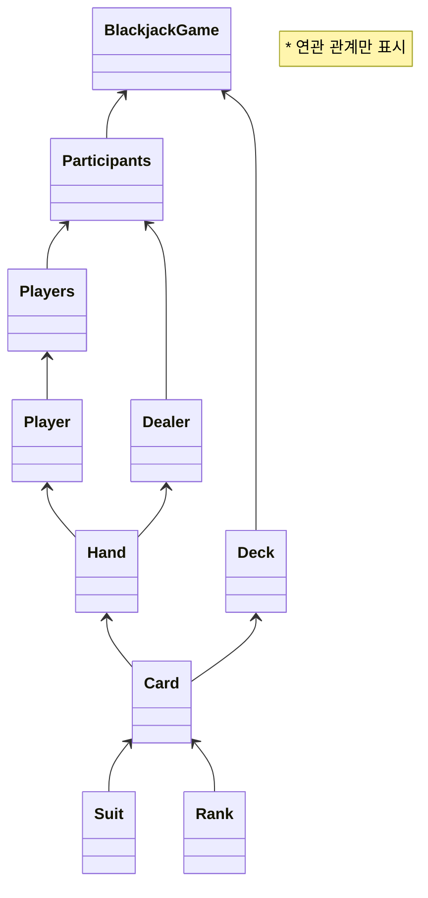
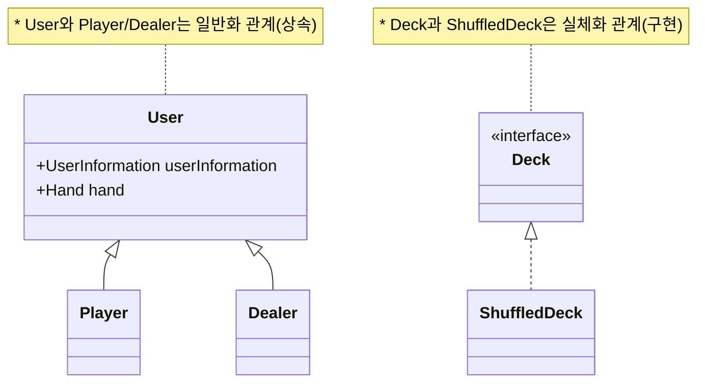
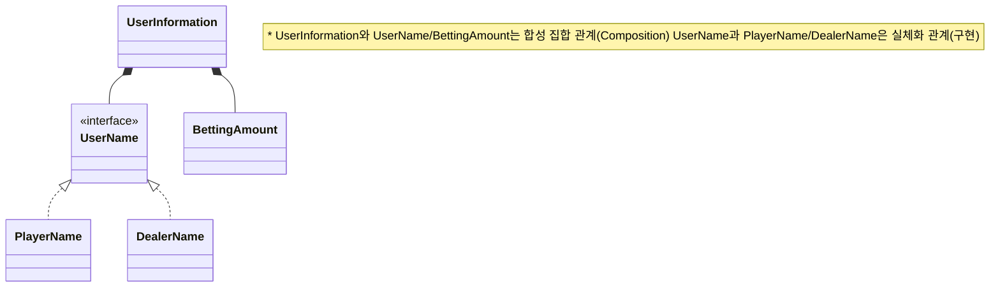

# java-blackjack

블랙잭 미션 저장소

## 우아한테크코스 코드리뷰

- [온라인 코드 리뷰 과정](https://github.com/woowacourse/woowacourse-docs/blob/master/maincourse/README.md)

## 클래스 다이어그램
### 주요 클래스

### User 관련 클래스

### UserInformation 관련 클래스

## 기능 구현 목록

### InputView
- [x] 플레이어들의 이름을 입력받는다.
- [x] 사용할 덱의 개수를 입력받는다.
- [x] 플레이어의 배팅 금액을 입력받는다.
- [x] 플레이어가 카드를 더 받을지 여부를 입력받는다.
  - [x] 잘못된 입력을 하면 안내 메시지를 출력하고 다시 입력 받는다.

### OutputView
- [x] 딜러와 플레이어 초기 카드 발급 결과를 출력한다.
- [x] Hit, Stay 시 Player의 카드 현황을 출력한다.
- [x] 딜러와 플레이어의 최종 수익을 출력한다.

### BlackjackGame
- 블랙잭 게임 규칙에 따라 게임을 진행
- [x] 덱의 개수를 검증 후 덱을 생성한다.
- [x] 모든 Plyaer와 Dealer에게 카드를 2장씩 전달한다.
  - [x] Deck에서 카드를 받아 User에게 전달한다.
- [x] 사용자의 의사를 확인하여 카드를 추가로 발급한다.
- [x] 딜러가 카드를 더 받을 수 있으면 추가로 발급한다.
- [x] 모든 유저의 카드 현황을 반환한다.
- [x] 딜러와 각 플레이어의 최종 수익을 반환한다.

### Participants
- 게임의 모든 참가자(플레이어, 딜러)를 가지고 있는 클래스
- [x] 모든 참가자에게 초기 카드를 지급한다.
- [x] 딜러를 hit 또는 stay 한다.
- [x] 모든 플레이어의 최종 수익을 계산한다.
  - [x] 모든 플레이어의 결과를 계산한다.
    - [x] 플레이어가 bust이면 베팅 금액의 -1배를 딜러에게 받는다.
    - [ ] 플레이어가 bust가 아닌 경우
      - [x] 플레이어가 블랙잭이면
        - [x] 딜러가 블랙잭이 아닌 경우 베팅 금액의 1.5배를 딜러에게 받는다.
        - [x] 딜러가 블랙잭이면 베팅한 금액을 돌려받는다.
      - [x] 플레이어가 딜러보다 점수가 높으면 베팅 금액의 1배를 딜러에게 받는다.
      - [x] 플레이어가 딜러와 점수가 같으면 베팅 금액을 돌려받는다.
      - [x] 플레이어가 딜러보다 점수가 낮으면 베팅 금액을 딜러에게 준다.
- [x] 딜러를 반환한다.
- [x] 플레이어들을 반환한다.

### User
- 게임에 참여하는 유저가 상속받는 클래스
- [x] CardHand의 점수를 계산한다.
- [x] 카드를 더 받을 수 있는 상황인지 확인한다. (Abstract)
- [x] CardHand에 Card를 저장한다.
- [x] CardHand의 점수가 블랙잭인지 확인한다.
- [x] 이름을 반환한다.

### Dealer (extends User)
- 플레이어와 비교하여 승패를 결정하는 유저
- [x] 카드를 더 받을 수 있는 상태인지 확인한다. (Override)
  - [x] 점수가 16점 이상이면 카드를 더 받을 수 없다.

### Player (extends User)
- 게임에 참여하는 유저
- [x] 카드를 더 받을 수 있는 상태인지 확인한다. (Override)
  - [x] 점수가 21점 이상이면 카드를 더 받을 수 없다.
- [x] 베팅 금액을 반환한다.

### Players
- Player를 감싸는 일급 컬렉션
- [x] Player들을 반환한다.

### UserInformation
- 유저의 이름과 베팅 금액 정보를 가지고 있는 클래스
- [x] 이름을 반환한다.
- [x] 베팅 금액을 반환한다.

### UserName (Interface)
- 유저의 이름 정보를 가지고 있는 객체의 규격

### PlayerName (implements UserName)
- Player의 이름 정보를 가지고 있는 객체
- [x] 유효한 이름인지 검증한다.
  - [x] 예외 처리) 빈 이름
  - [x] 예외 처리) 사용이 금지된 이름
  - [x] 예외 처리) 너무 긴 이름
- [x] 이름 값을 반환한다.

### DealerName (implements UserName)
- Dealer의 이름 정보를 가지고 있는 객체
- [x] 딜러의 기본 이름으로 생성한다.
- [x] 유효한 이름인지 검증한다.
  - [x] 예외 처리) 빈 이름
- [x] 이름 값을 반환한다.

### BettingAmount
- 베팅 금액 정보를 가지고 있는 객체
- [x] 올바른 베팅 금액인지 검증한다.
- [x] 베팅 금액을 반환한다.

### Deck (Interface)
- [x] 1개의 카드를 반환한다.

### ShuffledDeck (implements Deck)
- 상징 별, 숫자 별 Card 52장 더미를 n개 생성해서 가지고 있는 객체
- [x] 상징, 숫자 별 카드를 생성한다.
  - [x] 순서를 랜덤하게 섞는다.
- [x] 1개의 카드를 반환한다.

### Card
- 카드 한장
- [x] 숫자를 반환한다.
- [x] 카드 정보에 대한 텍스트를 반환한다.

### Suit (enum)
- Card가 가지고 있는 상징
- [x] 카드 상징에 대한 정보를 갖고 있는 상수 집합을 구현한다.
- [x] 상징의 이름을 반환한다.

### Rank (enum)
- Card가 가지고 있는 숫자
- [x] 카드가 가질 수 있는 숫자 정보를 갖고 있는 상수 집합을 구현한다.
  - [x] Ace는 1의 숫자를 가지고 있는다.
  - [x] Jack, Queen, King 10으로 계산한다.

### Hand
- 유저가 가지고 있는 카드 뭉치
- [x] 카드 뭉치에 카드를 하나씩 추가한다.
- [x] 점수를 반환한다.
  - [x] Ace는 점수의 유불리에 따라 1 또는 11로 계산한다.

### Result (enum)
- 게임 결과 정보
- [x] 게임 결과에 대한 정보를 갖고 있는 상수 집합을 구현한다.

### ExceptionCounter
- [x] 잘못된 입력 개수를 더한다.
  - [x] 특정 횟수 이상의 잘못된 입력이 들어오면 프로그램을 종료한다.
