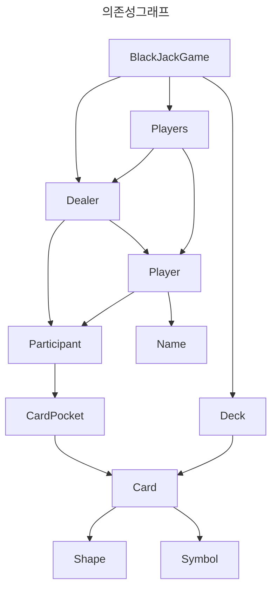

# java-blackjack

블랙잭 미션 저장소

## 우아한테크코스 코드리뷰

- [온라인 코드 리뷰 과정](https://github.com/woowacourse/woowacourse-docs/blob/master/maincourse/README.md)

# 기능구현 목록

## UI

1. 입력
    - [x] 베팅 금액을 입력받는다
2. 출력
    - [x] 최종 수익을 출력한다

## 도메인

1. BettingMoney
    - [x] 사용자에 베팅 금액을 받는다
        - [예외처리] 0 이상의 숫자인지 확인한다
    - [x] 베팅 금액에 대한 수익률을 계산한다
2. CardPocket
    - Card 와 관련된 도메인에 대한 애그리거트 루트입니다
    - 도메인 외부로 조회된 결과를 반환할 때 CardResponse 형태로 바꾸어 반환합니다
3. Participants
    - 플레이어와 딜러에 대한 애그리거트 루트입니다
    - 외부에서 발생하는 모든 조회는 Participant 를 통해 조회해야합니다
4. ResultType
    - 블랙잭 게임과 관련된 결과를 담당하는 클래스 입니다
5. BLackjackRule
    - 블랙잭 게임의 결과를 계산하는 도메인 서비스입니다
    - Player 와, Dealer 를 받아서 수익률을 계산합니다

## UI

1. 입력

- 참여할 사람을 입력한다
- List<String>으로 변환 및 반환한다

## 도메인

1. Deck
    - [x] 카드를 생성한다
        - [x] 총 52장
        - [x] Shape마다 13장을 출력
    - [x] 카드를 나눠준다

2. BlackJack
    - 딜러와 플레이어에게 카드를 2장씩 나눠준다.
      -- 카드를 나눠준다
3. Participant
    - [x] 21 이상인지 확인하고
        - [x] 21 이상이라면,
            - [x] 블랙잭인지 확인한다 = 받을 수 없음
            - [x] BURST인지 확인한다 = 받을 수 없음4
    - [x] 현재 점수를 숫자 형태로 반환한다
    - [x] 현재 카드를 반환한다
4. Player
    - [x] 21 미만이면, 받을 수 있다는 boolean
5. Dealer
    - [x] 16 이하이면, 받을 수 있따는 boolean
6. CardPocket
    - [x]  카드의 Symbol 점수를 계산한다.(ScoreCalculator 역할)
    - 카드반환 한다
    - [x] 카드 계산 총합 반환
7. Shape
    - [x] enum 형태로 하트, 스페이스, 클로버, 다이아를 저장한다
8. Symbol
    - [x] a=1 2-9, j,q,k =10
    - [x] value는 int 형으로 저장한다
9. Card
    - [x] Shape와 Symbol을 저장하는 자료구조

10. Players
    - [x] 플레이어 이름 중복
    - [x] 플레이어 수 1명이상, 5명 이하
    - [x] 플레이어에게 카드 나눠주기
    - [x] 플레이어의 draw여부 알기
11. Name
    - [x] isBlank 체크
    - [x] 100자 이하 체크
