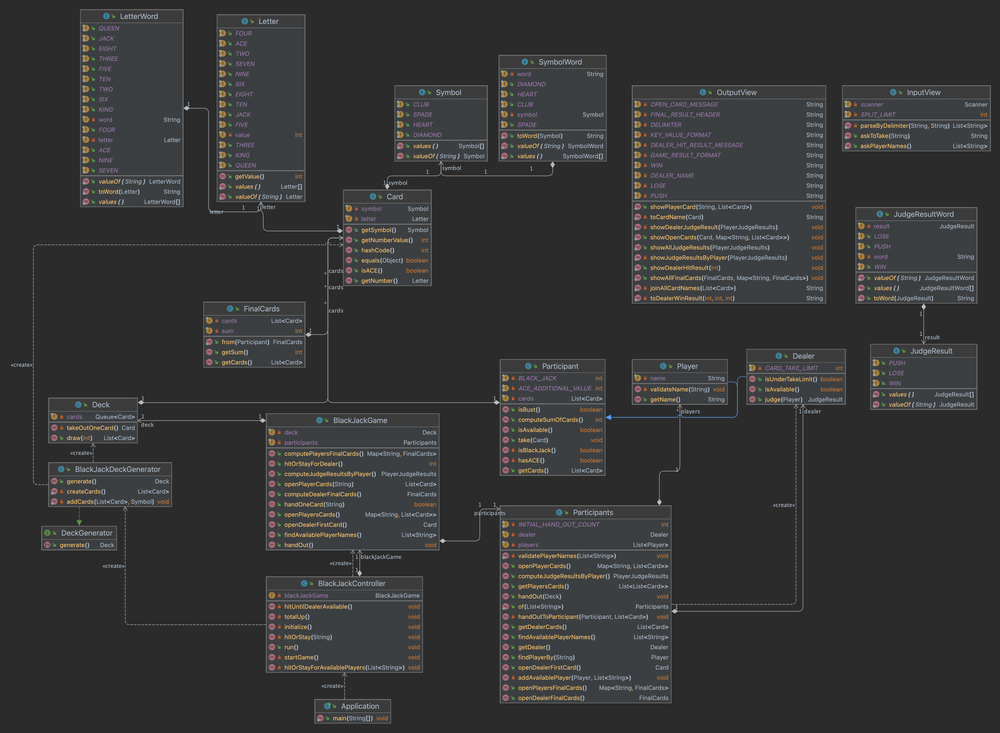
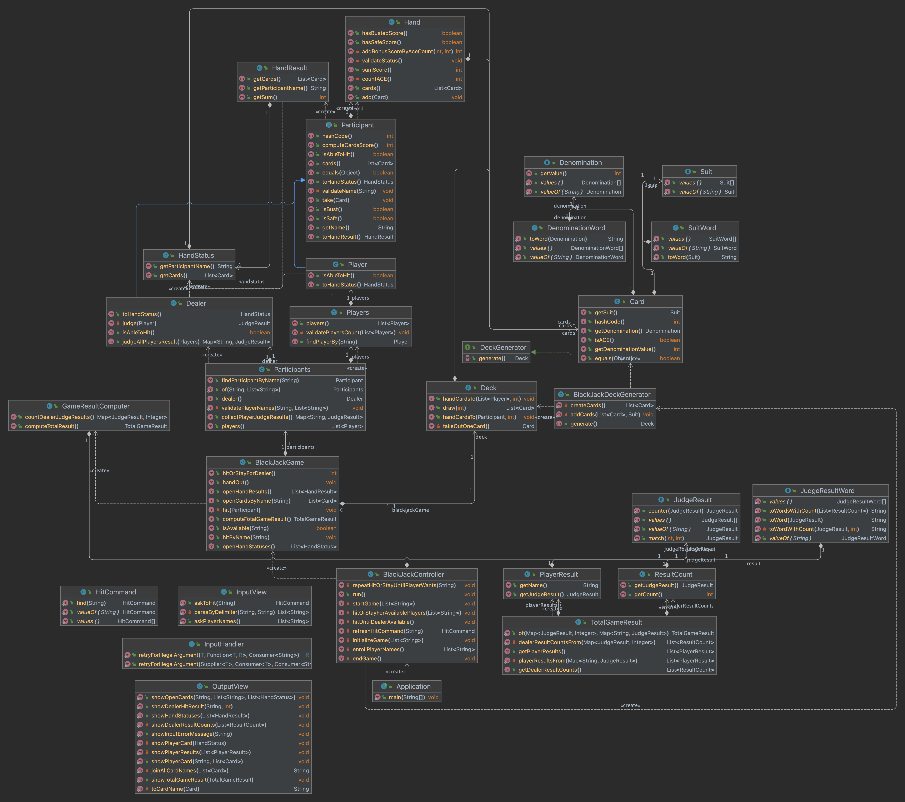

# 📝 블랙잭 미션 명세

블랙잭 미션 저장소

## 🗄구성 요소

### 도메인 구성 요소

- 카드 덱
    - 카드
        - 슈트
        - 끗수 (2~10, Ace, King, Queen, Jack)
- 참가자
    - 딜러
    - 플레이어
        - 이름
        - 핸드 (보유 카드)
        - 베팅 금액

### UI 출력 구성 요소

- 핸드 결과
    - 참가자 이름
    - 보유 카드
    - 점수 (최종 결과에만 전달)
- 최종 수익 결과
    - 참가자 별 최종 수익

## 🚀 기능 목록

### 도메인 기능

#### 컨트롤러

- [x] 특정 플레이어가 히트/스테이가 가능하면 계속 묻는다.

#### 카드

- [x] 카드를 생성한다.
- [x] 카드는 슈트(스페이드, 하트, 클로버, 다이아몬드)를 가진다.
- [x] 카드는 끗수(2~10, Ace, King, Queen, Jack)을 가진다.
    - [x] 각 끗수는 값을 가진다.
    - [x] King, Queen, Jack은 10으로 계산한다.
- [x] 카드의 끗수가 에이스이면 참을 반환한다.

#### 카드 덱

- [x] 카드 덱은 여러 장의 카드를 가진다.
- [x] 주어진 장수만큼 카드를 뽑는다.
    - [x] `예외` 카드 덱에 더 이상 카드가 없다면 예외를 발생한다.
- [x] 전달받은 참가자에게 주어진 장수 만큼의 카드를 준다.

#### 블랙잭 게임

- [x] 블랙잭 게임은 덱을 만든다.
- [x] 블랙잭 게임은 참가자를 가진다.
    - [x] 참가자 중 딜러의 이름을 전달받은 이름으로 저장한다.
- [x] 게임 시작을 위해 카드를 나눠준다.
- [x] 플레이어의 보유 카드를 모두 확인한다.
- [x] 딜러의 보유 카드를 한 장만 확인한다.
- [x] 딜러의 보유 카드를 모두 확인한다.
- [x] 참가자의 히트 가능 여부를 확인한다.
- [x] 히트 가능한 모든 플레이어를 반환한다.
- [x] 특정 플레이어에게 카드를 준다.
- [x] 딜러가 히트가 가능하면 계속 카드를 준다.
- [x] 모든 플레이어의 최종 게임 결과를 확인한다.

#### 블랙잭 결과

- [x] 이름, 보유카드, 결과를 가진다.

#### 블랙잭 게임 덱 생성기

- [x] 카드들을 만든다.
    - [x] `예외` 카드 덱은 중복을 허용하지 않는다.
    - [x] `예외` 카드 덱의 카드 장수는 52장이어야 한다.
- [x] 카드들을 섞는다.

#### 참가자

- [x] 참가자는 카드를 한장씩 받을 수 있다.
- [x] 참가자가 가지고 있는 카드의 합을 알 수 있다.
- [x] 참가자가 블랙잭/버스트(현재 가진 카드 합이 21 이상)인지 판단한다.

#### 참가자들

- [x] 참가자들은 딜러와 1~n명의 플레이어로 이루어져 있다.
    - [x] `예외` 플레이어의 이름 간 중복을 허용하지 않는다.
    - [x] `예외` 플레이어의 이름과 딜러의 이름 간 중복을 허용하지 않는다.
    - [x] `예외` 플레이어 인원수는 최소 2명, 최대 8명이다.

#### 딜러

- [x] 딜러는 참가자이다.
- [x] 딜러는 이름을 가진다.
- [x] 자신의 카드 중 첫 번째 카드만 반환한다.
    - [x] `예외` 가지고 있는 카드가 없으면 예외를 발생한다.
- [x] 히트할 수 있는지 판단한다. (17 미만인 경우)
- [x] 플레이어를 전달받아 승무패 여부를 판단한다.
    - 버스트인 플레이어는 무조건 패배이다.
    - 딜러가 버스트이면, 버스트가 아닌 플레이어는 무조건 승리이다.
    - 딜러가 버스트가 아니면, 버스트가 아닌 플레이어는 딜러와 카드 합을 비교해서 승패를 결정한다.
- [x] 플레이어를 전달받아 해당 플레이어에게 주거나 받을 수익을 계산한다.

#### 플레이어

- [x] 플레이어는 참가자이다.
- [x] 참가자는 베팅 금액을 가진다.
- [x] 플레이어는 이름을 가진다.
    - [x] `예외` 빈 문자열이거나 공백인 이름은 허용하지 않는다.
- [x] 히트할 수 있는지 판단한다. (21 미만인 경우)

#### 핸드

- [x] 0 ~ n장의 카드를 나타낸다.
- [x] 카드 끗수의 총 합을 계산해 반환한다.
    - [x] 끗수 중 ACE는 기본값을 1로 하되, 추가 값 10을 더할 수 있다.
    - [x] ACE가 여러 장이라면 버스트 되지 않을 때까지만 추가 값을 더한다.
    - [x] `예외` 카드를 가지고 있지 않으면 예외를 발생한다.
- [x] 카드 끗수의 총 합이 21을 초과하면 참을 반환한다. (버스트)
- [x] 카드 끗수의 총 합이 21 미만이면 참을 반환한다. (버스트 이전 최대 값)
- [x] 카드 끗수의 총 합이 21 이고 카드 수가 2장이면 참을 반환한다. (블랙잭)

#### 베팅 금액

- [x] 베팅 금액은 0보다 큰 수이다.
    - [x] `예외` 금액이 1000 이하인 경우 예외를 발생시킨다.

#### 판정 결과

- [x] 결과로는 블랙잭 , 승(일반 승리), 무, 패가 있다.
- [x] 블랙잭 고려 없이 두 수를 비교할 수 있다.
- [x] 주어진 판정 결과를 전달받아서 상대방의 결과를 반환한다.
- [x] 각 결과마다 다르게 수익을 계산한다.
    - 블랙잭 승리: `베팅금액*(1.5)`
    - 일반 승리: `베팅금액*1`
    - 무승부: `베팅금액*0` (둘 다 블랙잭인 경우 포함)
    - 패배: `베팅금액*(-1)`
    - 소수점은 버리고 정수로 반환한다.

#### 게임 결과 계산기

- [x] 딜러를 포함한 모든 참가자 별 최종 수익을 계산한다.

### UI 기능

- [x] 플레이어의 이름을 입력받는다.
    - [x] 이름을 쉼표 기준으로 분리한다.
- [x] 플레이어의 베팅 금액을 입력받는다.
    - [x] `예외` 입력값이 정수가 아닌 경우 예외를 발생시킨다.
- [x] 카드를 더 받을지 여부를 정해진 키워드로 입력받는다.
    - [x] `예외` 입력값이 정해진 키워드가 아닌 경우 예외를 발생시킨다.
- [x] 카드를 나눠준 결과를 출력한다.
- [x] 플레이어가 가진 카드들을 출력한다.
- [x] 딜러가 카드를 받은 여부를 출력한다.
- [x] 최종 카드 합산 결과를 출력한다.
- [x] 최종 수익을 출력한다.

## ✅ 1단계 리뷰 반영 및 리팩터링 목록

### 클래스 다이어그램

- 리팩터링 전
  
- 리팩터링 후
  

### refactor

- [x] Controller 실행 코드 메서드 분리
- [x] Participant에서 끗수 합 계산하도록 수정
- [x] 블랙잭/버스트 여부 확인 메서드 호출 관계 수정
- [x] 플레이어 히트/스테이 관련 상위 로직 수정
    - [x] 플레이어 히트/스테이 메서드 재귀 대신 반복문으로 수정
    - [x] 플레이어 카드 지급과 상태 확인 기능 분리
- [x] 모호한 클래스명, 메서드명 수정
    - [x] GameResult -> FinalCards (최종 보유 카드, 계산된 끗수 합)
    - [x] WinResult -> JudgeResult, PlayerWinResults -> PlayerJudgeResults
    - [x] 도메인 용어 반영
        - [x] Number -> Letter -> Denomination (숫자 -> 문자 -> 끗수)
        - [x] Symbol -> Suit (심볼 -> 슈트)
        - [x] Cards -> Hand (카드 뭉치 -> 핸드)
- [x] 딜러와 플레이어 정보 조회 및 출력 중복코드 통합
    - [x] Dealer 클래스에도 name 필드 추가
    - [x] Participant 부모 클래스 추상클래스로 변경, 추상 메서드 활용
- [x] 클래스 책임 검토, 필요에 따라 분리
    - [x] Participants 클래스 책임 분리
        - [x] Players 일급 콜렉션 객체 분리
        - [x] Dealer에서 첫번째 카드만 반환하는 메서드 직접 수행
        - [x] Dealer에서 모든 플레이어의 판정 결과 계산 직접 수행
        - [x] Participants 클래스는 참가자 조회 관련 기능만 하도록 변경
    - [x] Cards 일급콜렉션 객체 분리
        - [x] Cards 객체에서 카드의 끗수 합 계산하도록 책임 이관
    - [x] 두 값을 비교해 승무패를 결정하는 클래스 분리
    - [x] 게임 결과를 조회하는 도메인 로직 단순화
    - [x] DTO 적용
        - [x] 게임 결과 출력 로직 단순화
        - [x] 핸드 결과 출력 로직 단순화
- [x] 매직 넘버 상수화
    - [x]  히트/스테이 명령어
    - [x]  첫번째 카드 인덱스 값
- [x] VO에 equals, hashCode 재정의하기
    - [x] Participant 클래스에 재정의
- [x] 딜러 판정 결과 관련 클래스 분리
    - [x] 딜러의 판정 결과(승/무/패) 별 개수를 전달하는 클래스 정의하여 도메인에서 전달
    - [x] 판정 결과 문자열 관리 클래스에서 판정 결과를 통계 형식으로 출력하도록 함
- [x] final 키워드 적용
- [x] 일부 클래스 패키지 이동
    - [x] InputHandler util 패키지로 이동
    - [x] HitCommand domain 패키지로 이동

### feat, fix

- [x] 참여자 이름에서 예약어(딜러) 검증 추가
- [x] 플레이어 인원 수 검증 추가
- [x] 플레이어가 버스트인 경우 패배 처리
- [x] 카드 끗수 합 계산 시 ACE가 여러 장일 경우 처리
- [x] 잘못된 입력에 대한 오류 안내 및 재입력 요청 기능 구현
- [ ] 그 외 고려하지 못한 예외 사항 검토

### test

- [x] 최종 승패 결정 테스트 케이스 추가 (승, 무, 패)
- [x] 단위 테스트 중복 코드 제거
- [x] 누락된 단위 테스트 추가
- [x] 테스트 메서드명 컨벤션 통일 (대소문자, 언더바 등)
- [x] 단위 테스트와 다른 메서드의 실행결과 의존 검토
    - Player, Dealer에 카드를 직접 주입받는 생성자 추가하여 해결

## ✅ 2단계 리뷰 반영 및 리팩터링 목록

- [x] todo 주석 삭제
- [x] 검증 메서드 호출 순서 수정
- [x] 카드 관련 Enum 상수 뷰-도메인 중복 통합
- [x] 입출력 관련 메시지 모두 상수화하는 것으로 통일
- [x] 수익 결과 계산 주체 딜러에서 판정결과로 이동
- [x] 통화 단위 고려하여 베팅 금액 및 수익 데이터 타입 변경
- [x] 딜러 이름 외부 주입받는 대신 딜러 클래스에 공개 상수로 정의
- [ ] 에러메시지 상수화해서 관리
