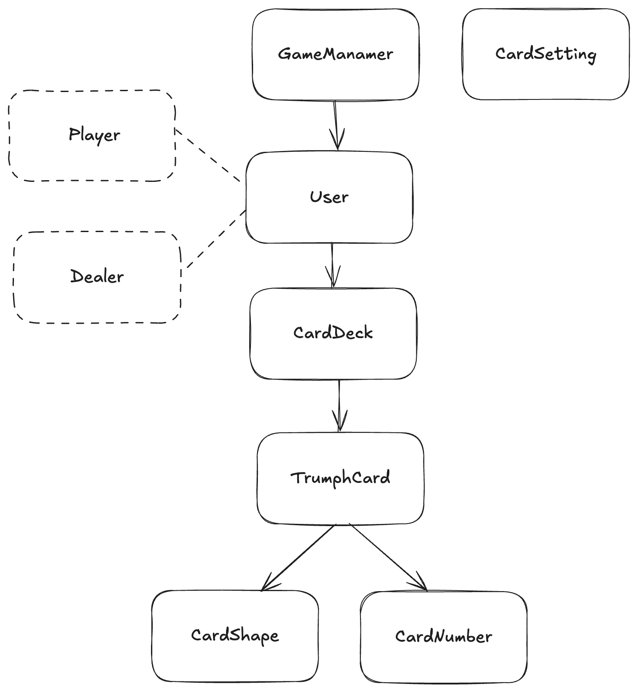

# java-blackjack

블랙잭 미션 저장소

## 구현 기능 내용
### 입력 기능
- [x] 참여자 이름을 입력받는다.
  - 구분자를 기준으로 입력받는다.
- [x] 카드를 플레이어가 추가로 받을 건지 여부를 입력받는다.
- [x] 플레이어들의 베팅 금액을 입력받는다.

### 출력 기능
- [x] 카드를 참여자에게 몇 장 나눠줬는지 출력
- [x] 참여자가 받은 실제 카드를 모두 출력
  - 딜러는 1장만 출력
- [x] 플레이어가 카드를 더 받게됐을 때 현재 카드 내역을 출력
- [x] 딜러가 카드를 한장 더 받는지 여부를 출력
- [x] 최종적으로 각각의 참여자들이 갖고 있는 카드 내역과 점수 출력
- [x] 최종 승패를 출력
- [x] 최종 수익을 출력

### 핵심 기능
- [x] 참여자가 카드를 한장 뽑는 기능
- [x] 참여자가 갖고 있는 카드를 오픈하는 기능
  - 딜러일 때 맨 앞 카드만 공개
  - 플레이어일 때 모든 카드를 공개
- [x] 참여자에게 카드를 추가로 한 장 더 주는 기능
  - 딜러는 16 이하면 받는다.
  - 플레이어는 입력 값(y/n)에 따라 받는다.
- [x] 합계 점수 계산 기능
- [x] 딜러의 카드 패(hands) 전체 오픈 기능
- [x] 최종 승패 계산 기능
- [x] 카드 점수 계산 기능
  - 숫자 카드는 숫자 그대로
  - J/Q/K는 10점
  - ACE는 바로 아래에서 설명한다.
- [x] 합계에 따라 Ace의 값을 1 또는 11로 계산하는 기능
  - 플레이어가 유리한 방향으로 계산한다.
  - 한번 계산한 값은 유리한 방향에 따라 변경될 수 있다.
  - 예시
    - 5하트, A클로버 -> A는 11로 계산. 합계 16.
    - (카드 한 장 추가) 5하트, A클로버, 10스페이드 -> A는 1로 계산. 합계 16.
- [x] 버스트를 판단하는 기능
- [x] 플레이어가 게임 시작 시 배팅 금액을 정하는 기능
- [ ] 처음 두 장의 카드 합이 21일 경우 블랙잭이 되면 베팅 금액의 1.5 배를 딜러에게 받는다.
  - [x] 딜러와 플레이어 모두 동시에 블랙잭인 경우 플레이어는 베팅한 금액을 돌려받는다.
- [ ] 딜러가 21을 초과하면 그 시점까지 남아 있던 플레이어들은 가지고 있는 패에 상관 없이 승리해 베팅 금액을 받는다.
- [x] 딜러와 참가자들의 최종 수익을 계산한다.

### 예외 기능
- [ ] 이름을 입력할 때 구분자와 영문이 아닌 값이 입력되면 예외를 발생한다.

## 프로그램 흐름도

## 용어 사전
- deck: 카드 묶음
- hands: 카드 패
- dealer: 딜러
- player: 플레이어
- participant: 참여자. 딜러(dealer)와 플레이어(player)를 총칭
