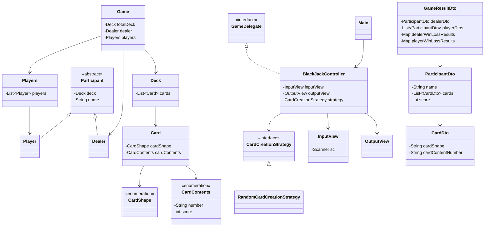

# ♠️ java-blackjack

블랙잭 미션 저장소

---

## 📌 프로젝트 개요

콘솔 기반으로 즐길 수 있는 블랙잭 게임입니다.

## 🚀 기능 요구 사항

### 1. 게임 준비 및 카드 분배

- [x] 참여할 플레이어들의 이름을 쉼표(,) 기준으로 입력받는다.
    - 예외: 이름이 공백이거나 한글/영문이 아닌 경우.
    - 예외: 최대 참여 인원(5명)을 초과하는 경우.
- [x] 딜러와 플레이어들에게 무작위로 섞인 카드를 2장씩 나누어 준다.
- [x] 분배된 초기 카드를 출력한다. (딜러는 1장만 공개)

### 2. 카드 추가 발급 (Hit / Stand)

- [x] 각 플레이어에게 카드를 더 받을지(y/n) 입력받는다.
- [x] 'y'를 입력하면 카드를 1장 추가로 지급하고 현재 카드를 출력한다.
- [x] 카드의 합이 21을 초과(Bust)하면 더 이상 카드를 받을 수 없다.
- [x] 딜러는 플레이어의 턴이 모두 끝난 후, 카드의 합이 16 이하이면 카드를 1장 더 받는다. (17 이상이면 받지 않음)

### 3. 점수 계산 및 승패 판정

- [x] J, Q, K는 10으로 계산한다.
- [x] Ace(A)는 1 또는 11 중 카드 합산 범위(21)를 초과하지 않는 유리한 방향으로 계산한다.
- [x] 딜러와 플레이어의 점수를 비교하여 최종 승패를 결정한다.
    - 딜러가 Bust인 경우, Bust되지 않은 플레이어는 모두 승리한다.
    - 점수가 같을 경우 무승부로 처리한다.

### 4. 게임 결과 출력

- [x] 모든 참가자의 최종 카드 목록과 점수를 출력한다.
- [x] 딜러와 플레이어들의 최종 승패(승/무/패)를 출력한다.

## 🗂️ 클래스 다이어그램

```mermaid
classDiagram
%% 1. 도메인 클래스 선언
    class Game {
        -Deck totalDeck
        -Dealer dealer
        -Players players
    }
    class Participant {
        <<abstract>>
        -Deck deck
        -String name
    }
    class Player {
    }
    class Dealer {
    }
    class Players {
        -List~Player~ players
    }
    class Deck {
        -List~Card~ cards
    }
    class Card {
        -CardShape cardShape
        -CardContents cardContents
    }
    class CardShape {
        <<enumeration>>
    }
    class CardContents {
        <<enumeration>>
        -String number
        -int score
    }
    class CardCreationStrategy {
        <<interface>>
    }
    class RandomCardCreationStrategy {
    }

%% 2. 컨트롤러 및 뷰 클래스 선언
    class Main {
    }
    class GameDelegate {
        <<interface>>
    }
    class BlackJackController {
        -InputView inputView
        -OutputView outputView
        -CardCreationStrategy strategy
    }
    class InputView {
        -Scanner sc
    }
    class OutputView {
    }

%% 3. DTO 클래스 선언
    class GameResultDto {
        -ParticipantDto dealerDto
        -List~ParticipantDto~ playerDtos
        -Map dealerWinLossResults
        -Map playerWinLossResults
    }
    class ParticipantDto {
        -String name
        -List~CardDto~ cards
        -int score
    }
    class CardDto {
        -String cardShape
        -String cardContentNumber
    }

%% Relationships
%% 도메인 내부 관계
    Game --> Deck
    Game --> Dealer
    Game --> Players
    Participant <|-- Player
    Participant <|-- Dealer
    Players --> Player
    Deck --> Card
    Card --> CardShape
    Card --> CardContents
    CardCreationStrategy <|.. RandomCardCreationStrategy
%% 컨트롤러 및 뷰 관계
    Main --> BlackJackController
    GameDelegate <|.. BlackJackController
    BlackJackController --> InputView
    BlackJackController --> OutputView
    BlackJackController --> CardCreationStrategy
%% DTO 관계
    GameResultDto --> ParticipantDto
    ParticipantDto --> CardDto
```

