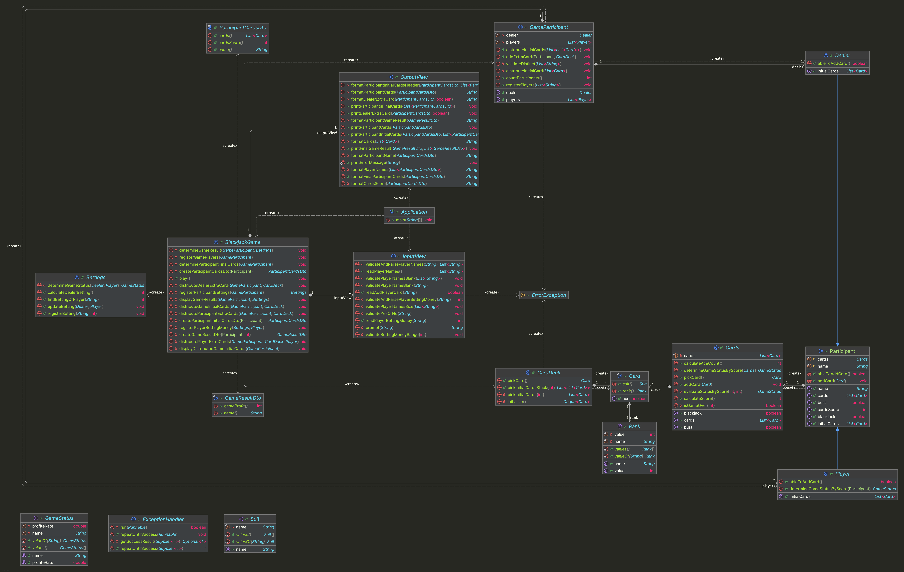

# java-blackjack

블랙잭 미션 저장소

## 우아한테크코스 코드리뷰

- [온라인 코드 리뷰 과정](https://github.com/woowacourse/woowacourse-docs/blob/master/maincourse/README.md)

## 기능 목록

### 입력

- [x] 참여할 사람의 이름 입력
  - [x] 이름은 쉼표로 구분된다
  - [x] 공백은 허용하지 않는다
- [x] 각 참여자가 카드를 한장 더 받을지 입력
  - [x] 공백은 허용하지 않는다

### 출력

- [ ] 카드 나눔 메시지 출력
- [ ] 모든 플레이어가 가지고 있는 카드를 출력한다
- [ ] 카드를 받거나 받지 않으면 가지고 있는 카드를 출력한다
- [ ] 딜러가 카드를 더 받으면 받았다는 메시지를 출력한다
- [ ] 딜러와 모든 참여자의 카드와 결과를 출력한다
- [ ] 최종 승패를 출력한다

### 도메인

- [x] 참여자와 딜러
  - [x] 이름을 가진다
  - [x] 카드들을 가진다
  - [x] 가지고 있는 카드의 숫자를 계산할 수 있다
  - [x] 다른 사람의 점수와 비교할 수 있다
    

- [ ] 이름
  - [ ] 1~5자의 길이만 허용된다

- [x] 카드
  - [x] 타입을 가진다
  - [x] 숫자를 가진다

- [ ] 덱
  - [ ] 숫자 위치의 카드를 반환한다
  - [ ] 모든 카드를 가진다

- [x] 카드풀
  - [x] 카드를 가질 수 있다
  - [x] 카드 숫자의 합을 계산한다.
    - [x] 에이스는 11일 때 숫자의 합이 21이 넘으면 1로 계산한다

- [ ] 블랙잭 게임
  - [ ] 모든 참여자와 딜러의 승패를 가지고 있다 
  - [ ] 모든 딜러와 참여자는 카드를 뽑는 명령을 내린다
  - [ ] 모든 카드를 받아서 숫자를 비교한다
  - [ ] 덱을 초기화 한다
  - [ ] 21(버스트 숫자)을 넘으면 버스트(죽는다). 

- [ ] 숫자 생성기
  - [ ] 랜덤으로 숫자를 생성한다

## 객체 다이어그램

