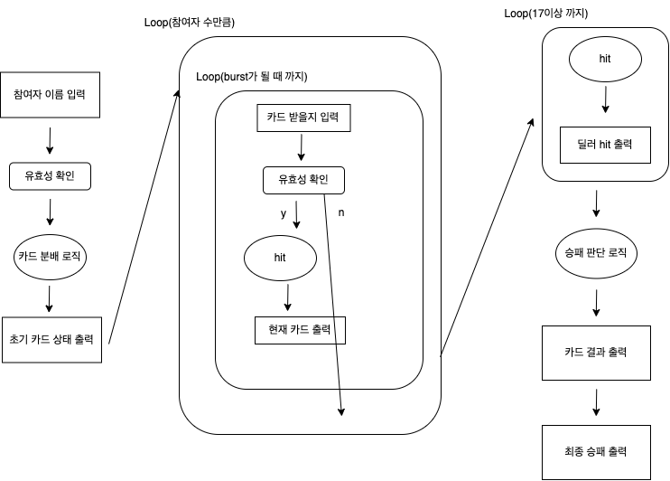

# java-blackjack

<br>

## 📚 도메인 모델 네이밍 사전

| 한글명    | 영문명           | 설명                            |
|--------|---------------|-------------------------------|
| 이름     | Name          | 참가자 이름을 지칭
| 참가자    | Participant   | 블랙잭 게임에 참가하는 사람을 지칭           |
| 딜러     | Dealer        | 딜러 지칭                         |
| 플레이어   | Player        | 플레이어 지칭                       |
| 배팅금액 | Amount | 참가자의 배팅금액을 지칭|
| 플레이어들  | Players       | 플레이어들을 지칭                     |
| 카드     | Card          | 카드 지칭                         |
| 에이스 카드 | AceCard       | 에이스 카드 지칭                     |
| 일반 카드  | StandardCard  | 에이스 카드와 궁정 카드를 제외한 일반 숫자카드 지칭 |
| 궁정 카드  | CourtCard     | Jack, Queen, King 세가지 궁정카드를 지칭 |
| 카드 덱   | Cards         | 게임 참여자가 소유하고 있는 카드들을 지칭       |
| 카드 풀   | Deck          | 게임 참여자가 소유하고 있지 않은 모든 카드들을 지칭 |
| 심판     | Referee       | 결과를 계산하는 심판 지칭  |
| 블랙잭 게임 | BlackJackGame | 게임 실행 역활을 하는 블랙잭 게임을 지칭 | 
| 게임 결과  | Result | 게임 결과를 지칭 |

<br>

## 👨‍🍳 기능 목록

### 입력(InputView)

- [x] 참여자의 이름을 입력받는다.
- [x] 카드를 받을지 입력을 받는다.
- [x] 참여자들의 배팅 금액을 입력받는다.
  - [x] 숫자가 아닌 경우 예외처리

### 도메인(domain)

- 이름
    - [x] (유효성 검사) 공백과 널이면 안 된다.
- 참가자
    - 인스턴스 변수 : Cards, Name
    - [x] 모든 참가자는 전체 카드뭉치에서 하나의 랜덤한 카드를 뽑는다.(hit)
    - [x] 자기가 가지고 있는 Cards의 점수를 반환
    - [x] 인스턴스 변수로 Cards를 갖는다.
    - [x] 인스턴스 변수로 Name을 갖는다.
- 플레이어들(Players)
    - [x] 문자열을 ','를 기준으로 분리한다.
    - [x] 플레이어 객체를 생성하고 저장한다.
    - [x] 플레이어들의 배팅 금액을 설정한다.
- 플레이어
  - 인스턴스 변수 : Amount 
  - [x] 인스턴스 변수로 Amount을 갖는다.
  - [x] 배팅 금액을 업데이트한다.
  - [x] 0원인 경우 예외처리
- 딜러
- 카드
    - [x] 인스턴스 변수로 패턴과 심볼을 갖는다.
- 에이스 카드
    - [x] 기본적으로 11의 값을 반환한다.
- 일반 카드
    - [x] 숫자 값이 2보다 작거나 10보다 크면 안된다.
    - [x] 심볼과 동일한 수의 값을 반환한다.
- 궁정 카드
    - [x] 심볼 값이 "J", "Q", "K" 중 하나여야 한다.
    - [x] 10의 값을 반환한다.
- 카드 덱
    - [x] 카드를 한 장씩 추가할 수 있어야 한다.
        - [x] 단, null은 안 된다.
    - [x] 카드의 개수를 반환해야 한다.
    - [x] 카드의 점수의 합을 반환해야 한다.
- 카드 풀
    - [x] 초기에 모든 카드(52장)를 가지고 있어야 한다.
    - [x] 카드를 한 장씩 제거할 수 있어야 한다.
    - [x] 카드는 카드 풀에 존재하는 카드 중 하나를 랜덤으로 골라 추출해야 한다.
- 심판
    - [x] 전체 플레이어들의 승패를 판단한다.
    - [x] 플레이어들의 수익을 계산한다. 
- 블랙잭게임
    -  [x] 초기 카드 설정을 할 수 있어야 한다.
    -  [x] 카드를 뽑을 수 있어야 한다.
    -  [x] 점수를 계산할 수 있어야 한다.
    -  [x] 버스트인지 알 수 있어야 한다.
    -  [x] 유효한 점수인지 알 수 있어야 한다.
    -  [x] 계속해서 카드를 뽑을 수 있는지 알 수 있어야 한다.
    -  [x] 플레이어의 결과를 반환해야 한다.
    -  [x] 심판의 결과를 반환해야 한다.
- 게임 결과
  - [x] 승, 무, 패 상태를 가진다.
  - [x] 블랙잭 상태 추가
    - 처음 두 장의 카드의 합이 21인 경우

### 출력(OutView)

- [x] 초기 카드 목록를 출력한다.
    - [x] 참여자별로 카드 목록을 출력한다.
- [x] 특정 참여자의 '현재' 카드 목록를 출력한다.
- [x] 딜러가 카드를 뽑았다는 기록을 출력한다.
- [x] 결과 카드 목록을 출력한다.
- [x] 참여자별로 카드 목록을 출력한다.
- [x] 최종 수익을 출력한다.

## 프로그래밍 요구사항

- 모든 엔티티를 작게 유지한다.
- 3개 이상의 인스턴스 변수를 가진 클래스를 쓰지 않는다.
- 딜러와 플레이어에서 발생하는 중복 코드를 제거해야 한다.

## 📌 Commit Convention

커밋 메시지는 다음과 같은 형태로 작성합니다.

```Bash
> "커밋의 타입: 커밋 메세지 내용"
ex) "docs: 기능 목록 추가"
```

커밋의 타입은 아래 10가지 중 가장 적절한 것을 선택해 작성합니다.

| 커밋의 타입 |                       설명                        |
| :---------: | :-----------------------------------------------: |
|    feat     |                 새로운 기능 추가                  |
|     fix     |                     버그 수정                     |
|   comment   |             필요한 주석 추가 및 변경              |
|    test     |                 테스트 코드 추가                  |
|    docs     |      문서를 추가 혹은 수정 (ex. README 수정)      |
|   rename    |     파일 혹은 폴더명을 수정하거나 옮기는 작업     |
|   remove    |            파일을 삭제하는 작업만 수행            |
|    chore    |    빌드 태스크 업데이트, 패키지 매니저를 설정     |
|  refactor   |                   코드 리팩토링                   |
|    style    | 코드 포맷팅, 세미콜론 누락, 코드 변경이 없는 경우 |

- 상세한 컨벤션
  내용은 [Angular JS Git Commit Message Conventions](https://gist.github.com/stephenparish/9941e89d80e2bc58a153)
  를 참고

<br>

## 📌 Code Convention

- 구글 Java 코딩 컨벤션을 준수합니다.
- IntelliJ의 Formatter를 적용합니다.

## Flow Chart
