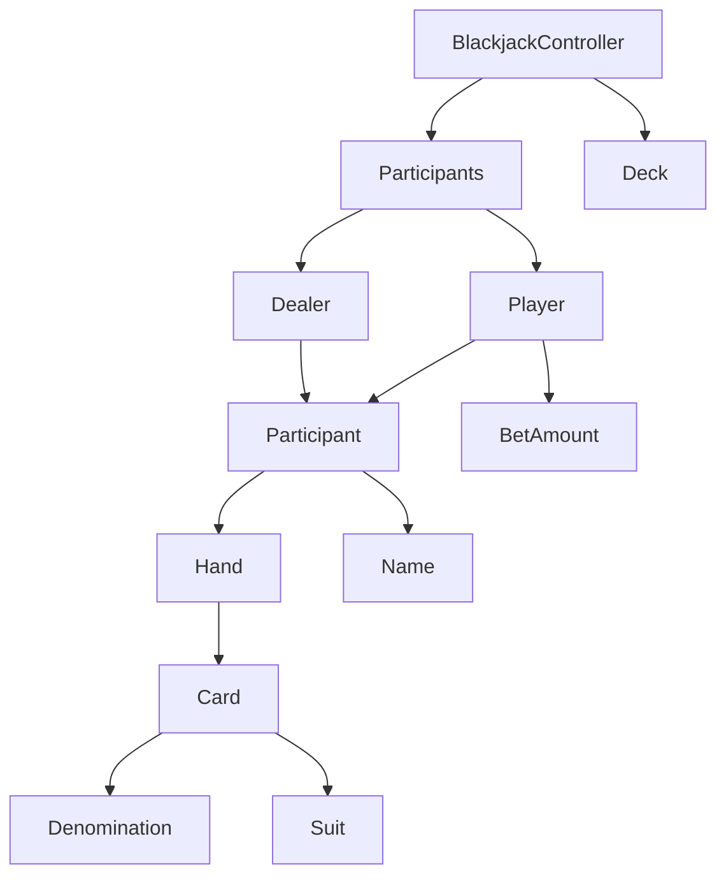

# 도메인 명세
- [x] 카드(Card)
  - [x] 숫자와 마크 조합으로 이루어진다
    - [x] 마크의 종류는 하트, 클로버, 스페이드, 다이아몬드
    - [x] 숫자는 1 ~ 10, J, Q, K
- [x] 카드들(Deck)
  - [x] 52가지 종류의 카드가 있다
  - [x] 사용하지 않은 카드를 뽑을 수 있다
    - [x] 사용한 카드는 제거된다
- [x] 딜러(Dealer)
  - [x] 카드를 가질 수 있다
  - [x] 카드들의 합을 구할 수 있다
    - [x] Ace를 11로 계산해도 총 합이 21이 넘지 않으면 11로 계산한다
  - [x] 카드들의 합이 16 이하이면 카드를 더 받는다
  - [x] 카드들의 합이 21 초과면 bust 이다
- [x] 플레이어(Player)
  - [x] 이름을 가진다
    - [x] 2 ~ 10 글자
    - [x] '딜러'를 이름으로 가질 수 없다
  - [x] 카드를 가질 수 있다
  - [x] 카드들의 합을 구할 수 있다
    - [x] Ace를 11로 계산해도 총 합이 21이 넘지 않으면 11로 계산한다
  - [x] 카드들의 합이 21 이하이면 더 받을 지 입력 받을 수 있다
    - [x] 카드를 추가로 뽑아 bust일 경우 배팅 금액을 모두 잃는다 
  - [x] 카드들의 합이 21 초과면 bust 이다
- [x] Participants
  - [x] 플레이어는 총 1 ~ 7 명
  - [x] 플레이어는 중복된 이름은 불가능 하다
- [x] Command
  - [x] "y" 혹은 "n"이 아니면 다시 입력받는다
- [x] BetMoney
  - [x] 1_000원 ~ 1_000_000원까지 입력 가능
  - [x] 1_000원 단위 입력 가능
- [x] BlackjackGame
  - [x] 승패를 구하는 기능
    - [x] 블랙잭 승리와 일반 승리를 구분 가능
  - [x] 수익을 구하는 기능

# 기능 명세

- [x] 참여자들의 이름을 입력받는 기능
  - [x] 이름은 ,로 구분한다
- [x] 참가자들의 배팅 금액을 입력받는 기능
- [x] 참여자들에게 최초 카드 두 장을 나누어주는 기능
- [x] 플레이어들의 버스트 여부를 기준으로 카드를 더 받는 기능
- [x] 딜러의 stand 여부를 기준으로 카드를 더 받는 기능

# 다이어그램

